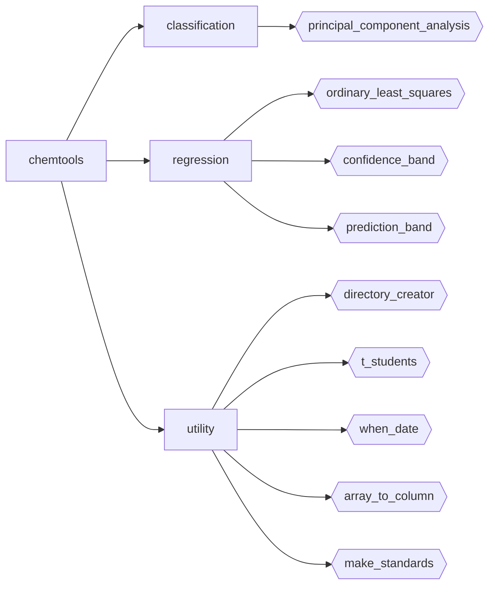

# chemtools
Maybe a library for a more easy way to do chemometrics in Python.

## Package structures

```mermaid
flowchart LR

chemtools --> classification
chemtools --> regression
chemtools --> utility

classification --> cl_fun1{{principal_component_analysis}}
regression --> re_fun_1{{ordinary_least_squares}}
regression --> re_fun_2{{confidence_band}}
regression --> re_fun_3{{prediction_band}}
utility --> ut_fun_1{{directory_creator}}
utility --> ut_fun_2{{t_students}}
utility --> ut_fun_3{{when_date}}
utility --> ut_fun_4{{array_to_column}}
utility --> ut_fun_5{{make_standards}}
```
read the [documentation](doc/Documentation.md).
