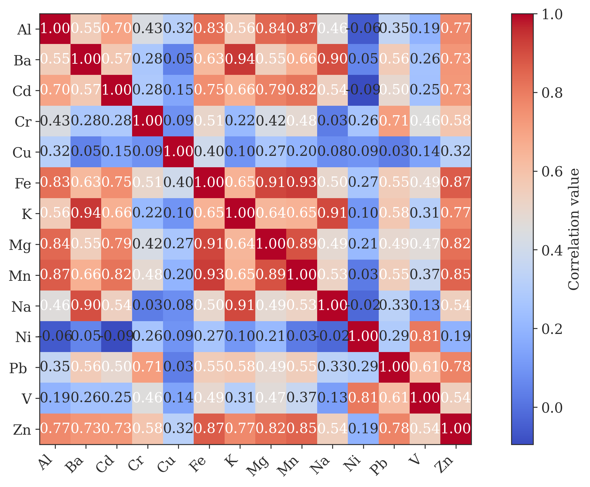
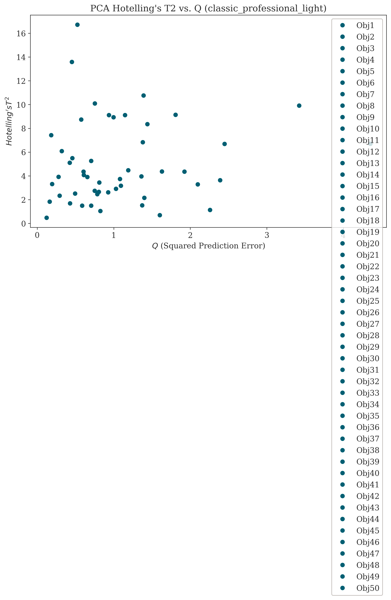
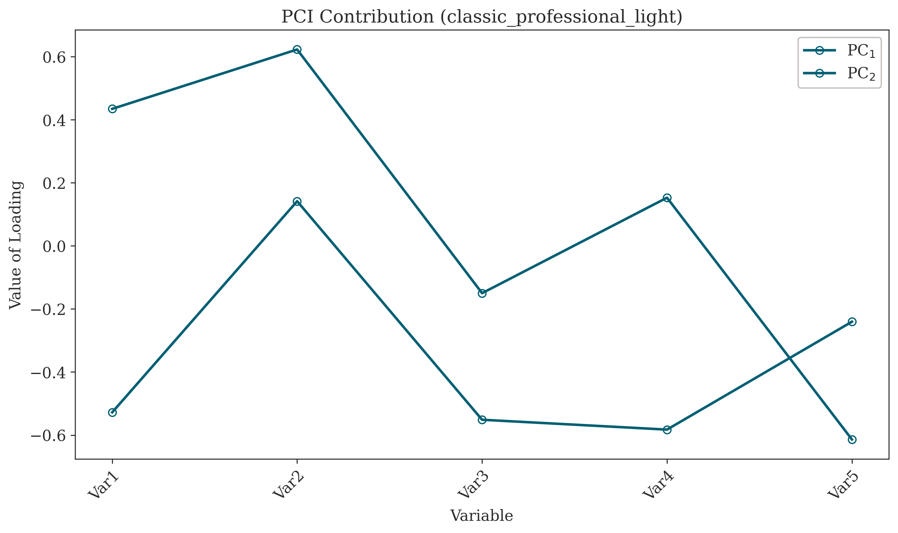

# Principal Component Analysis (PCA)

Principal Component Analysis (PCA) is a statistical procedure that uses an orthogonal transformation to convert a set of observations of possibly correlated variables into a set of linearly uncorrelated variables called principal components. This transformation is defined in such a way that the first principal component has the largest possible variance (that is, accounts for as much of the variability in the data as possible), and each succeeding component in turn has the highest variance possible under the constraint that it is orthogonal to the preceding components.

## Overview

The PCA module in chemtools provides comprehensive functionality for:
- Data preprocessing and autoscaling
- Principal component calculation
- Variance analysis
- Score and loading computation
- Statistical validation

## Usage

```python
from chemtools.exploration import PrincipalComponentAnalysis
from chemtools.plots.exploration import PCAplots

# Create and fit the model
pca = PrincipalComponentAnalysis()
pca.fit(X, variables_names=variables, objects_names=objects)

# Initialize plots with desired settings
plots = PCAplots(pca, library="matplotlib", theme="light", style_preset="default")

# Generate various plots
plots.plot_correlation_matrix()
plots.plot_eigenvalues()
plots.plot_loadings()
plots.plot_biplot()
plots.plot_scores()
```

## Key Features

### 1. Model Fitting and Transformation
- Automatic data preprocessing
- Eigenvalue decomposition
- Dimensionality reduction
- Data projection

### 2. Component Selection Criteria
- Kaiser criterion (eigenvalues > 1)
- Percentage of explained variance
- Scree plot analysis
- Average eigenvalue criterion
- Cumulative percentage criterion

### 3. Statistical Analysis
- Hotelling's T² statistic
- Q residuals
- Confidence intervals
- Contribution plots

## 4. Visualization

The `PCAplots` class provides a comprehensive suite of plots to visualize and interpret the results of a Principal Component Analysis.

### Correlation Matrix

This plot visualizes the correlation between the original variables. It helps to identify multicollinearity and understand the relationships between variables before reduction. Red indicates a positive correlation, blue indicates a negative correlation, and white indicates no correlation.



### Eigenvalue Plot (Scree Plot)

The scree plot is essential for determining the number of principal components to retain. It plots the eigenvalues of each component in descending order. Several criteria can be overlaid to help in this decision:
- **Eigenvalues > 1 (Kaiser Criterion):** A common rule of thumb is to keep components with eigenvalues greater than 1.
- **Broken Stick Model:** Compares the explained variance of each component to the expected variance if the total variance was randomly distributed.
- **Average Eigenvalue (AEC):** Retain components with eigenvalues above the average.


### Scores Plot

The scores plot shows the projection of the original observations (objects) onto the new principal component space. It is used to identify patterns, clusters, or outliers among the observations. Each point represents an object from your dataset.


### Loadings Plot

The loadings plot shows how the original variables contribute to the principal components. Variables that are close to each other are positively correlated, variables that are opposite are negatively correlated, and variables near the origin have little influence on the components shown.


### Biplot

The biplot is a powerful visualization that overlays the scores (observations) and the loadings (variables) in a single plot. This allows you to see the relationships between observations and how they are influenced by the original variables.


### Hotelling's T² vs. Q Residuals

This plot is a diagnostic tool for outlier detection.
- **Hotelling's T²:** Measures the variation within the PCA model (distance from the center of the model). Points far out on this axis may be considered outliers.
- **Q Residuals (or SPE):** Measures the variation not captured by the PCA model (distance of the observation to the model plane). High Q values indicate that the observation is not well-described by the model.



### PCI Contribution Plot

This plot shows the contribution of each original variable to each of the principal components. It helps in understanding which variables are most important for defining each component.




## API Reference

### PrincipalComponentAnalysis Class

```python
class PrincipalComponentAnalysis:
    def __init__(self)
    def fit(self, X, variables_names=None, objects_names=None)
    def reduction(self, n_components)
    def transform(self, X_new)
    def statistics(self, alpha=0.05)
```

### PCAplots Class

The `PCAplots` class is used to generate all the visualizations shown above.

```python
class PCAplots:
    def __init__(self, pca_object, library="matplotlib", theme="classic_professional_light", **kwargs)
    def plot_correlation_matrix(**kwargs)
    def plot_eigenvalues(criteria=None, **kwargs)
    def plot_loadings(components=(0, 1), **kwargs)
    def plot_scores(components=(0, 1), **kwargs)
    def plot_biplot(components=(0, 1), **kwargs)
    def plot_hotteling_t2_vs_q(**kwargs)
    def plot_pci_contribution(**kwargs)
```


## Citing Sources
Further reading can be found on Wikipedia:
- [Principal component analysis](https://en.wikipedia.org/wiki/Principal_component_analysis)

## Examples

See the `examples` directory for complete notebooks demonstrating PCA analysis workflows.