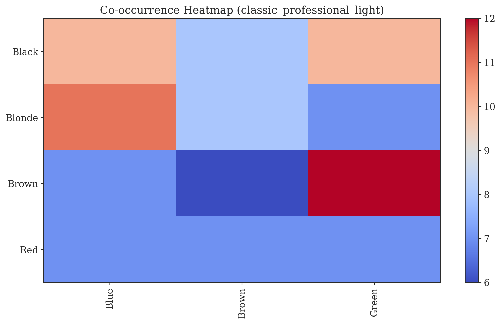
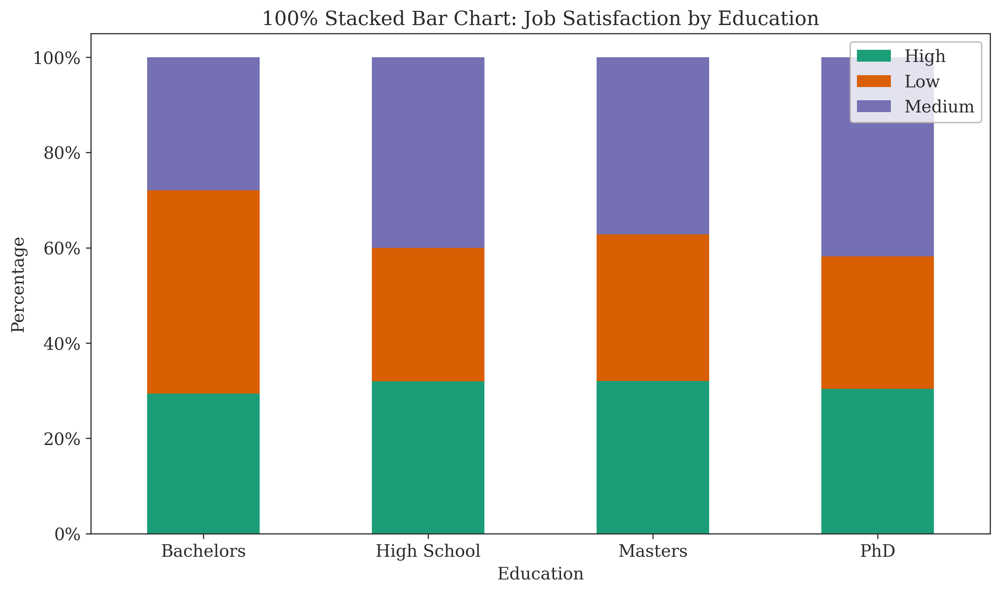
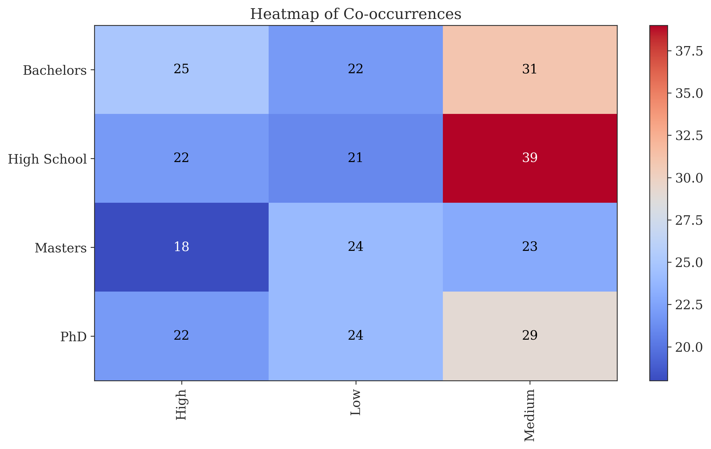
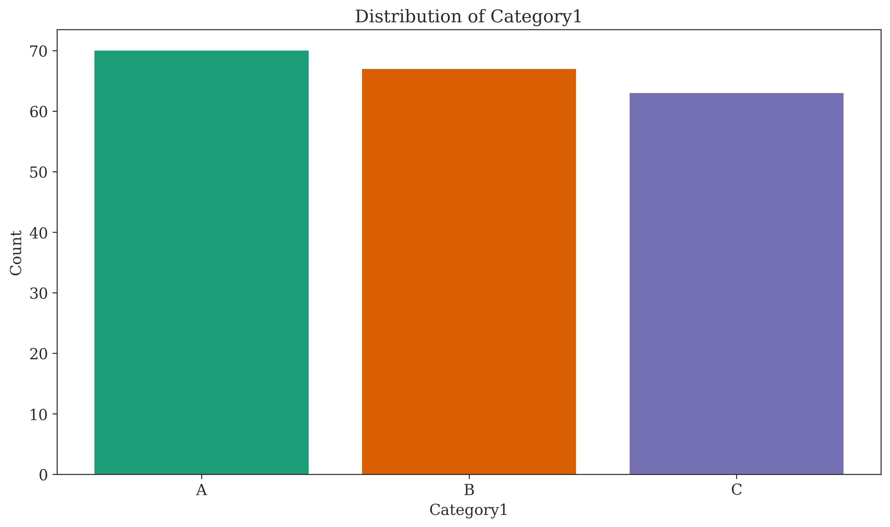
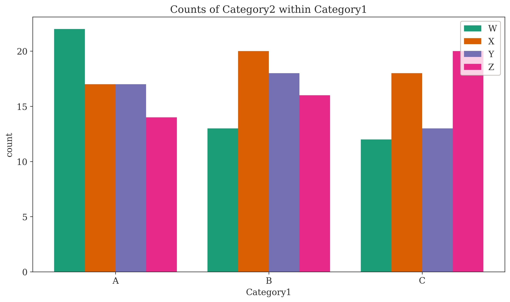
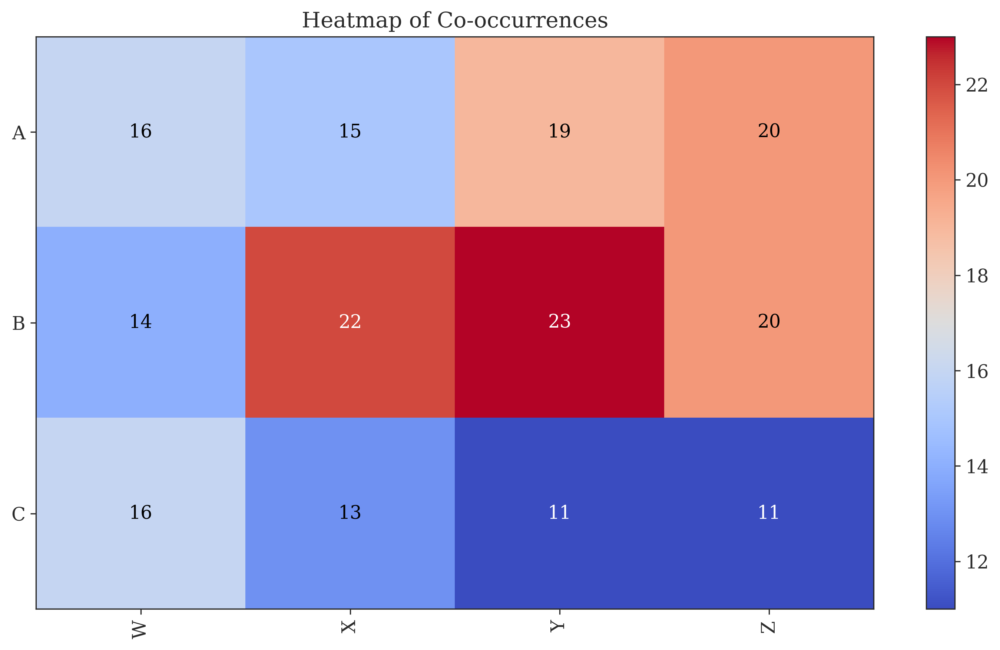

# Categorical Data Plots

This document covers plots specifically designed for visualizing datasets containing only categorical variables.

## Heatmap of Co-occurrences

While a standard heatmap visualizes a numerical matrix, it can be adapted to show the relationship between two categorical variables. By creating a contingency table (crosstab) that counts the co-occurrences of categories, we can visualize this table as a heatmap. The color of each cell represents the frequency of the combination of categories.

The `HeatmapPlot` class provides a convenient `plot_categorical` method for this purpose.

```python
from chemtools.plots.relationship.heatmap import HeatmapPlot

# plotter = HeatmapPlot()
# plotter.plot_categorical(data, x_column='Hair Color', y_column='Eye Color')
```

**Example:**
<picture>
  <source media="(prefers-color-scheme: dark)" srcset="../../img/plots/categorical/heatmap_categorical_classic_professional_dark.png">
  
</picture>

## Mosaic Plot

A mosaic plot is a graphical representation of a contingency table. The plot is divided into rectangles, where the area of each rectangle is proportional to the frequency of that cell in the table. This makes it an excellent tool for visualizing the relationships and proportions between two or more categorical variables.

The `chemtools` implementation uses `statsmodels` for the `matplotlib` backend and a `treemap` for the `plotly` backend, as it provides a similar representation.

```python
from chemtools.plots.categorical.mosaic import MosaicPlot

# plotter = MosaicPlot()
# plotter.plot(data, columns=['Hair Color', 'Eye Color'])
```

**Example (matplotlib):**
<picture>
  <source media="(prefers-color-scheme: dark)" srcset="../../img/plots/categorical/mosaic_plot_mpl_classic_professional_dark.png">
  
</picture>

**Example (plotly - Treemap):**
<picture>
  <source media="(prefers-color-scheme: dark)" srcset="../img/plots/categorical/mosaic_plot_plotly_classic_professional_dark.png">
  
</picture>

## Categorical Analysis Workflows

The `chemtools` library provides comprehensive tools for categorical data analysis, which can be integrated into various workflows for exploratory data analysis and hypothesis testing.

### Full Categorical Analysis Workflow

This workflow demonstrates a detailed analysis of categorical data, including 100% stacked bar charts and Chi-Squared tests.

**100% Stacked Bar Chart:**


**Crosstab Heatmap:**


### Basic Categorical Analysis Workflow

This workflow focuses on basic summaries and visualizations for categorical variables, including count plots and heatmaps of co-occurrences.

**Category Count Plot:**


**Grouped Count Plot:**


**Crosstab Heatmap:**

