# Plot Types

This document provides a detailed overview of the various plot types available in the `chemtools` plotting system. Each plot type is organized by category and includes a brief description, a code snippet for usage, and a list of its specific parameters. All plots leverage the `BasePlotter` for consistent theming and backend selection.

## Basic Plots

Located in `chemtools.plots.basic`.

### Bar Plot

The `BarPlot` class can be used to create simple bar charts showing the frequency of categories, or more complex stacked and grouped bar charts to compare values across multiple categories.

```python
from chemtools.plots.basic.bar import BarPlot

# plotter = BarPlot()
# For value counts of a single category:
# plotter.plot_counts(data, column, **kwargs)
# For plotting y vs x, with optional grouping/stacking:
# plotter.plot(data, x, y, color=None, mode='group', **kwargs)
# For plotting a pre-computed crosstab dataframe:
# plotter.plot_crosstab(crosstab_df, stacked=True, **kwargs)
```
-   `plot_counts`: Plots frequency of a single categorical column.
-   `plot`: Plots `y` vs `x` from long-format data. `mode` can be `'group'` or `'stack'`.
-   `plot_crosstab`: Plots a wide-format (crosstab) DataFrame directly. `stacked` can be `True` or `False`.

**Examples:**

*Simple Bar Plot of Counts*
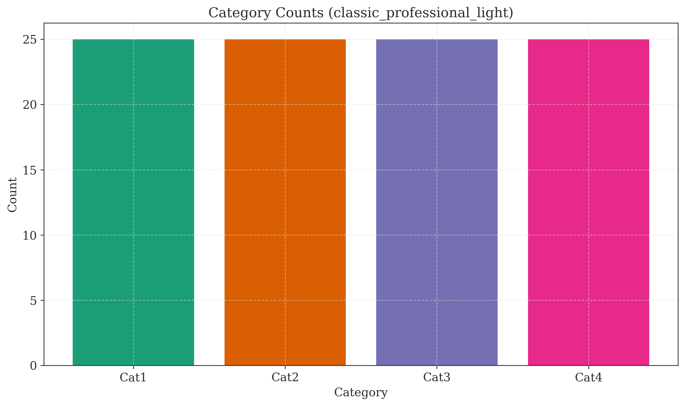
<details>
  <summary>Dark Theme Version</summary>
  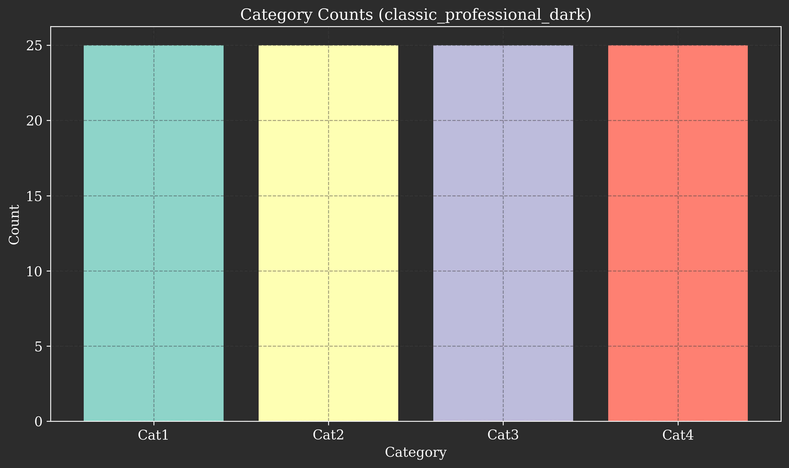
</details>

*Grouped Bar Plot*

<details>
  <summary>Dark Theme Version</summary>
  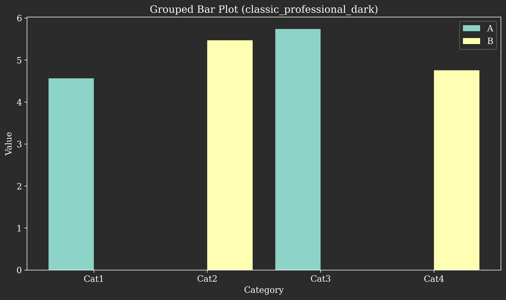
</details>

### Line Plot

Used for visualizing data points connected by straight line segments. It is especially useful for showing trends in data over time or another continuous interval. The `mode` parameter can also be set to `'dot'` or `'area'`.

```python
from chemtools.plots.basic.line import LinePlot

# plotter = LinePlot()
# plotter.plot(data, x_column, y_column, mode='line', **kwargs)
```
-   `mode`: Can be `'line'`, `'dot'`, or `'area'`.

**Example:**

<details>
  <summary>Dark Theme Version</summary>
  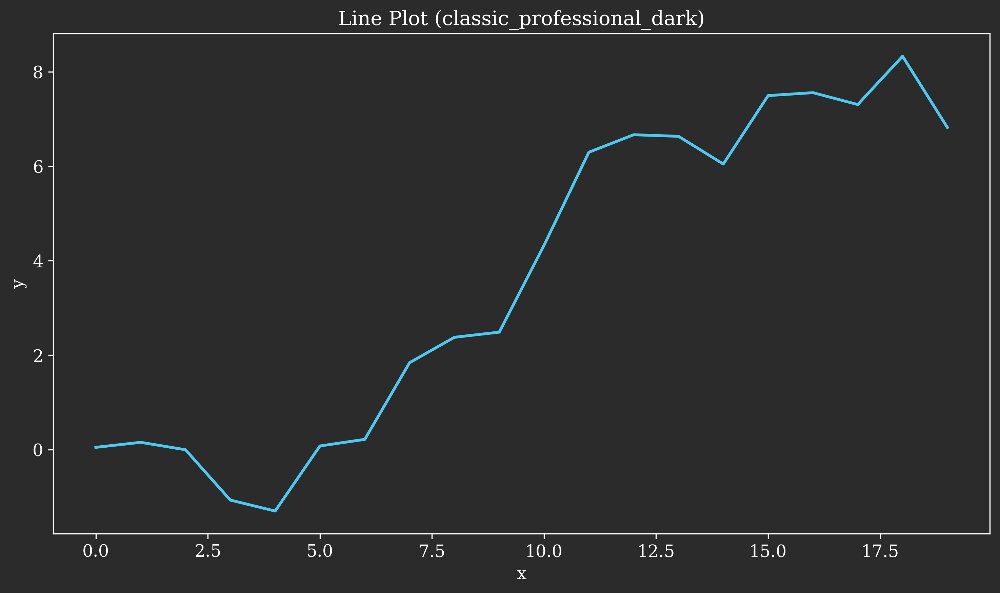
</details>

### Pie Plot

Pie charts are used to show the proportion of different categories in a dataset. The `hole` parameter can be used to create a donut chart.

```python
from chemtools.plots.basic.pie import PiePlot

# plotter = PiePlot()
# plotter.plot(data, names_column, values_column, hole=0, **kwargs)
```
-   `hole`: Creates a donut chart if > 0.

**Example:**
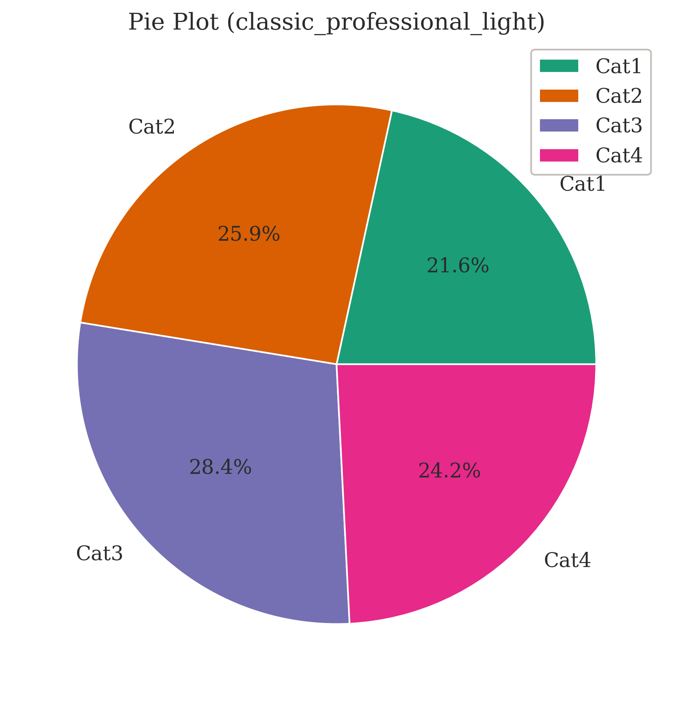
<details>
  <summary>Dark Theme Version</summary>
  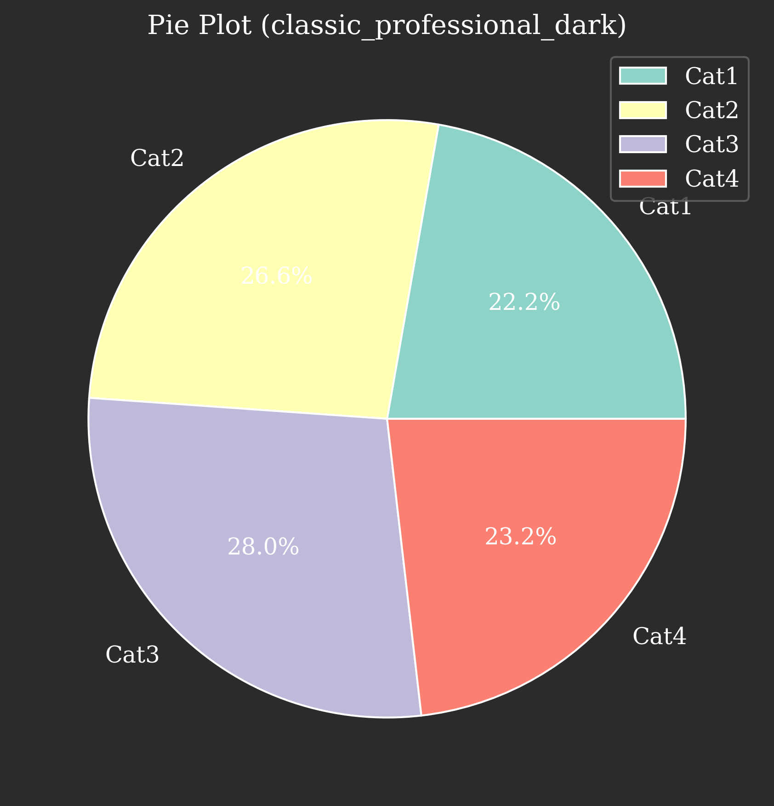
</details>

## Distribution Plots

Located in `chemtools.plots.distribution`.

### Histogram

A histogram is used to visualize the distribution of a numerical variable. It groups numbers into ranges (bins) and the height of the bar shows how many data points fall into that range. The `mode` can be set to `'density'` to show a Kernel Density Estimate (KDE) plot instead.

```python
from chemtools.plots.distribution.histogram import HistogramPlot

# plotter = HistogramPlot()
# plotter.plot(data, column, mode='hist', **kwargs)
```
-   `mode`: Can be `'hist'` or `'density'`.

**Example:**

<details>
  <summary>Dark Theme Version</summary>
  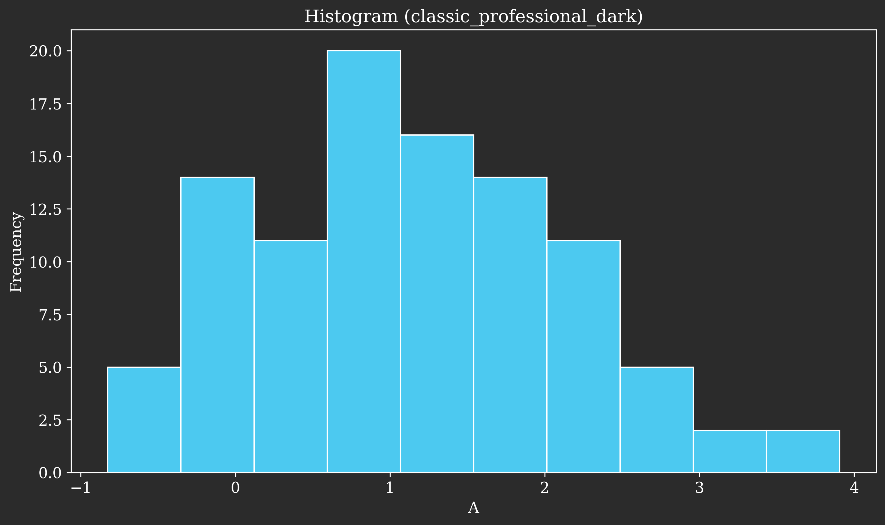
</details>

### Box Plot

A box plot (or box-and-whisker plot) displays the five-number summary of a set of data: minimum, first quartile (Q1), median, third quartile (Q3), and maximum. It is very effective for comparing distributions across multiple groups.

```python
from chemtools.plots.distribution.boxplot import BoxPlot

# plotter = BoxPlot()
# plotter.plot(data, y, x=None, **kwargs)
```
-   `y`: The numerical column to plot.
-   `x`: Optional categorical column for grouped plots.

**Example:**

<details>
  <summary>Dark Theme Version</summary>
  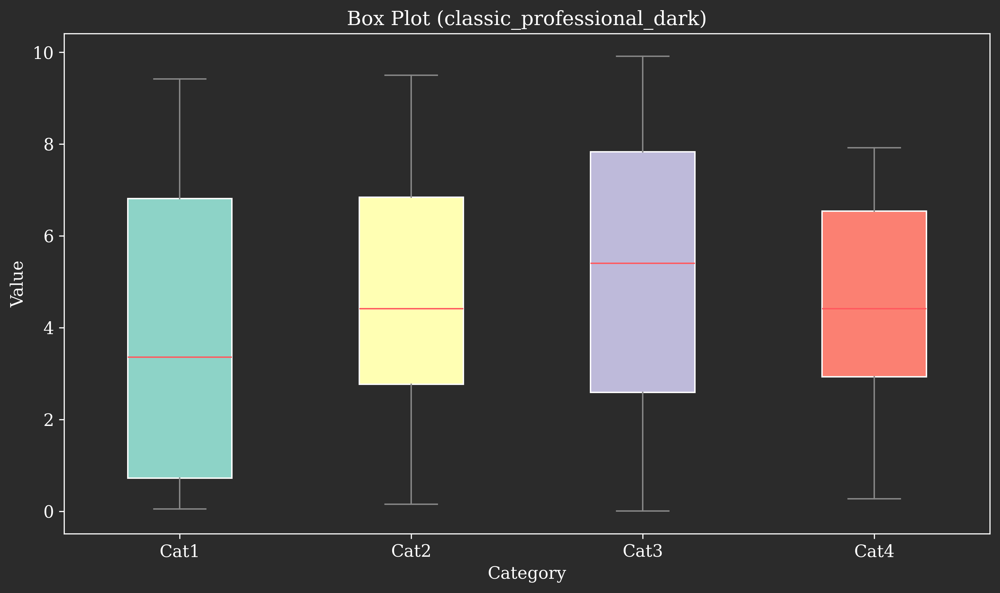
</details>

### Violin Plot

The violin plot is a powerful visualization that combines aspects of a box plot with a kernel density estimate. It shows the distribution of quantitative data across several categories, providing a richer understanding of the data's shape, central tendency, and spread than a simple box plot. Our enhanced violin plot also supports "raincloud" visualizations and automatic statistical annotations.

```python
from chemtools.plots.violin import ViolinPlot

# plotter = ViolinPlot()
# plotter.plot(data, y, x=None, show_jitter=False, show_mean=False, show_n=False, perform_stat_test=False, **kwargs)
```
-   `y`: The numerical column to plot.
-   `x`: Optional categorical column for grouped plots.
-   `show_jitter` (bool): If `True`, adds a "raincloud" of jittered data points, showing individual data points alongside the distribution.
-   `show_mean` (bool): If `True`, adds a distinct marker for the mean of each category, providing a clear indication of central tendency.
-   `show_n` (bool): If `True`, shows the sample size for each category on the x-axis labels, giving context to the distribution.
-   `perform_stat_test` (bool): If `True`, automatically performs pairwise t-tests between categories and annotates statistically significant results directly on the plot (matplotlib only).
-   `stat_annotations` (list): A list of dictionaries for manually plotting statistical comparisons (matplotlib only). This overrides `perform_stat_test` if provided.
-   `y_max_override` (float, optional): Manually sets the upper y-axis limit to ensure all annotations are comfortably visible.
-   `violin_alpha` (float, optional): Transparency (alpha) for the violin plot bodies (0.0 to 1.0). Overrides automatic adjustment.
-   `jitter_alpha` (float, optional): Transparency (alpha) for the jittered data points (0.0 to 1.0). Overrides automatic adjustment.

**Example (with jitter and mean):**

<details>
  <summary>Dark Theme Version</summary>
  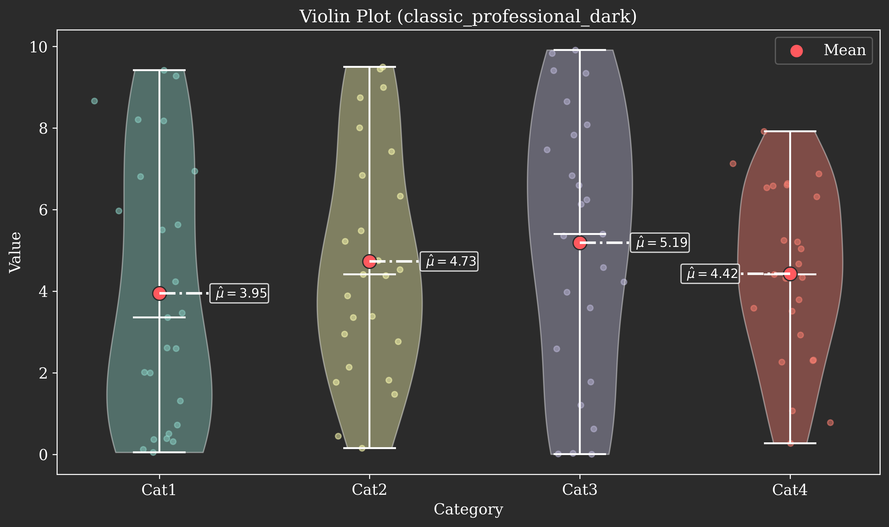
</details>

## Relationship Plots

Located in `chemtools.plots.relationship`.

### Scatter Plot

Scatter plots are used to visualize the relationship between two numerical variables. Each point on the plot represents an observation from the dataset. They are essential for identifying correlation, trends, and outliers. The `size_column` can be used to create a bubble chart, adding a third dimension to the visualization.

```python
from chemtools.plots.relationship.scatterplot import ScatterPlot

# plotter = ScatterPlot()
# plotter.plot_2d(data, x_column, y_column, size_column=None, **kwargs)
# plotter.plot_3d(data, x_column, y_column, z_column, **kwargs)
```
-   `size_column`: Creates a bubble chart if provided.

**Example:**
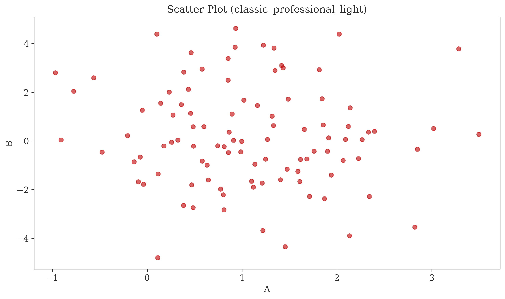
<details>
  <summary>Dark Theme Version</summary>
  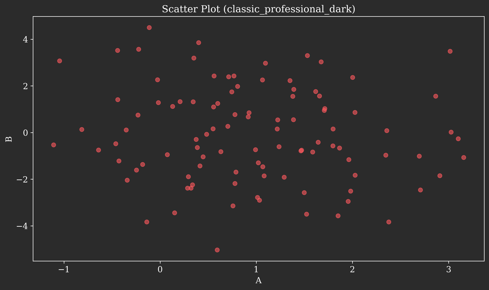
</details>

### Heatmap

Heatmaps are used to visualize a matrix of data, where individual values are represented as colors. They are particularly useful for displaying correlation matrices or the results of clustering.

```python
from chemtools.plots.relationship.heatmap import HeatmapPlot

# plotter = HeatmapPlot()
# plotter.plot(data, **kwargs)
```
-   `data`: pandas DataFrame representing the matrix to plot.

**Example (Correlation Matrix):**

<details>
  <summary>Dark Theme Version</summary>
  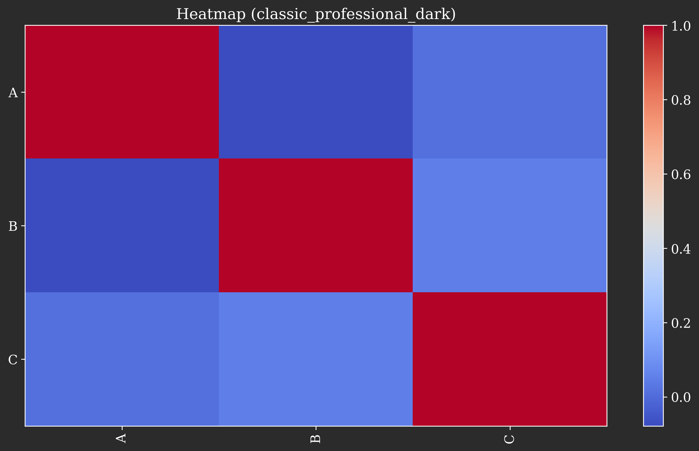
</details>

### Pair Plot

A pair plot creates a matrix of plots to visualize the relationships between several variables in a dataset. For numerical variables, it shows scatter plots for each pair and a distribution plot (like a histogram or KDE) on the diagonal. It's an excellent tool for exploratory data analysis.

```python
from chemtools.plots.relationship.pairplot import PairPlot

# plotter = PairPlot()
# plotter.plot(data, hue=None, **kwargs)
```
- `hue`: A categorical column to color the data points by.

**Example:**

<details>
  <summary>Dark Theme Version</summary>
  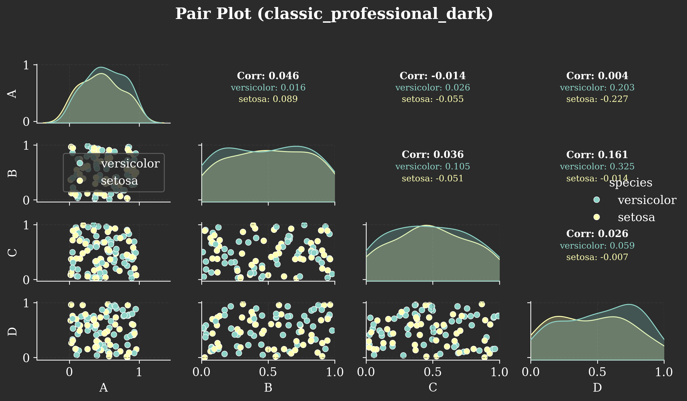
</details>

## Specialized Plots

Located in `chemtools.plots.specialized`.

### Parallel Coordinates Plot

This plot is used for visualizing high-dimensional data. Each vertical axis represents a different variable, and each colored line represents an observation, showing how it behaves across all variables. It is useful for identifying clusters and patterns.

```python
from chemtools.plots.specialized.parallel_coordinates import ParallelCoordinatesPlot

# plotter = ParallelCoordinatesPlot()
# plotter.plot(data, class_column, **kwargs)
```
-   `class_column`: Column to color the lines by.

**Example:**

<details>
  <summary>Dark Theme Version</summary>
  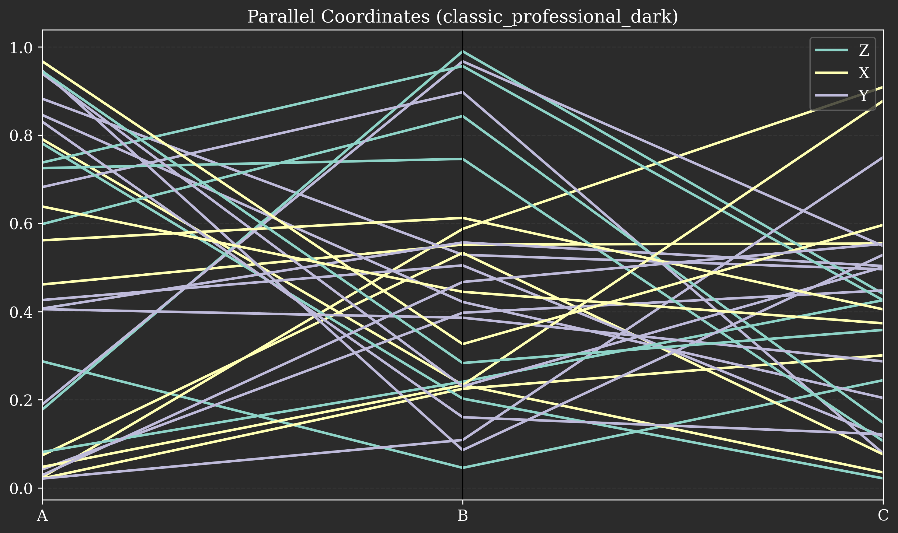
</details>

### Funnel Chart

A funnel chart is used to visualize the progressive reduction of data as it passes from one phase to another. It is commonly used to represent stages in a sales process or user engagement flow.

```python
from chemtools.plots.specialized.funnel import FunnelPlot

# plotter = FunnelPlot()
# plotter.plot(data, stage_column, values_column, **kwargs)
```
-   `data`: Should be sorted by funnel stage.

**Example:**

<details>
  <summary>Dark Theme Version</summary>
  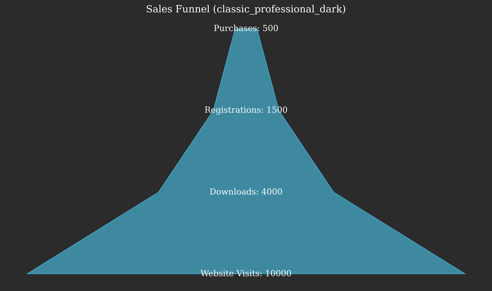
</details>

### Bullet Chart

A bullet chart is a variation of a bar chart designed to compare a primary measure (the "bullet") to a target measure, all within the context of qualitative ranges (e.g., poor, average, good).

```python
from chemtools.plots.specialized.bullet import BulletPlot

# plotter = BulletPlot()
# plotter.plot(value, target, ranges, title, **kwargs)
```
-   `value`, `target`, `ranges`: Numerical inputs for the chart.

**Example:**

<details>
  <summary>Dark Theme Version</summary>
  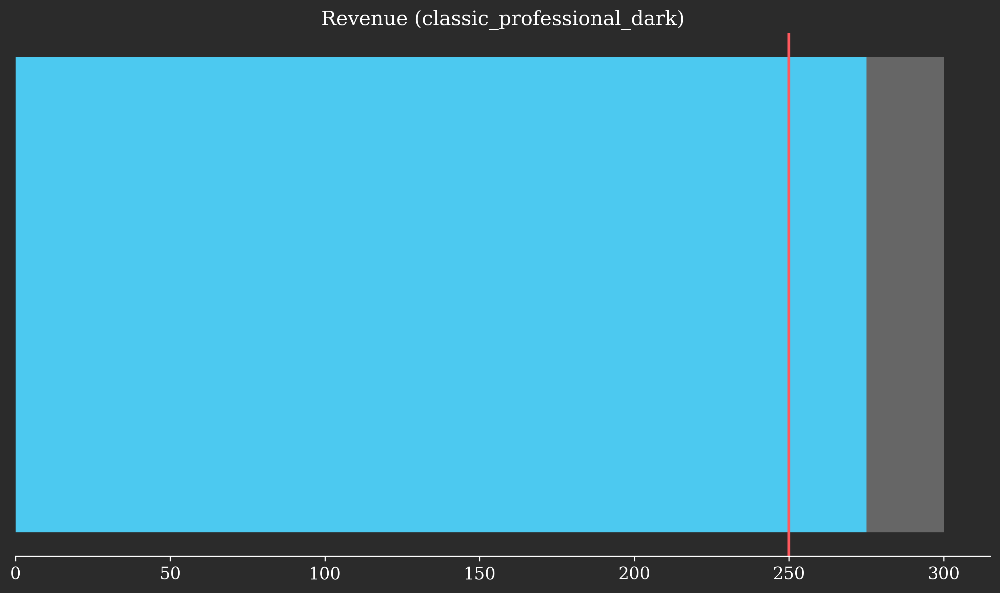
</details>

### Dual-Axis Chart

This chart allows for the visualization of two different variables with different scales on the same plot, using two separate y-axes (a left and a right axis). This is useful for comparing trends between two related metrics.

```python
from chemtools.plots.specialized.dual_axis import DualAxisPlot

# plotter = DualAxisPlot() # Matplotlib only
# plotter.plot(data, x_column, y1_column, y2_column, plot1_kind='bar', plot2_kind='line', **kwargs)
```
-   **Note:** Matplotlib library only.

**Example:**

<details>
  <summary>Dark Theme Version</summary>
  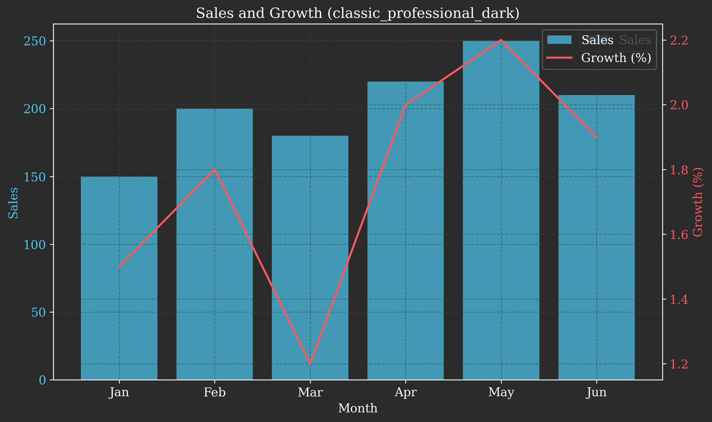
</details>

## Clustering Plots

Located in `chemtools.plots.clustering`.

### Dendrogram

A dendrogram is a tree-like diagram that records the sequences of merges or splits in a hierarchical clustering. It shows how clusters are related to one another and is the primary way to visualize the output of hierarchical clustering.

```python
from chemtools.clustering import HierarchicalClustering
from chemtools.plots.clustering import DendrogramPlotter

# model = HierarchicalClustering(X).fit()
# plotter = DendrogramPlotter()
# plotter.plot_dendrogram(model, **kwargs)
```

**Example:**

<details>
  <summary>Dark Theme Version</summary>
  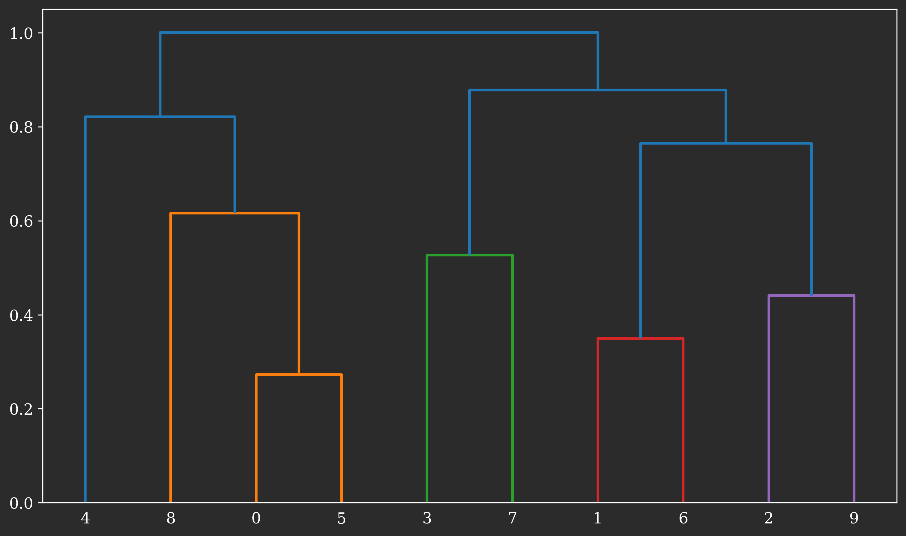
</details>

## Temporal Plots

Located in `chemtools.plots.temporal`.

### Run Chart

A run chart is a line graph of data plotted over time. It is used to find trends or patterns in the data.

```python
from chemtools.plots.temporal.run_chart import RunChartPlot

# plotter = RunChartPlot()
# plotter.plot(data, time_column, value_column, **kwargs)
```

**Example:**

<details>
  <summary>Dark Theme Version</summary>
  
</details>

## Regression Plots

Located in `chemtools.plots.regression`.

### Regression Results Plot

This plot provides a comprehensive visualization of a linear regression model, showing the original data points, the fitted regression line, and the confidence and prediction bands.

```python
from chemtools.regression import OLSRegression
from chemtools.plots.regression import RegressionPlots

# model = OLSRegression().fit(X, y)
# plotter = RegressionPlots(model)
# plotter.plot_regression_results(**kwargs)
```

**Example:**

<details>
  <summary>Dark Theme Version</summary>
  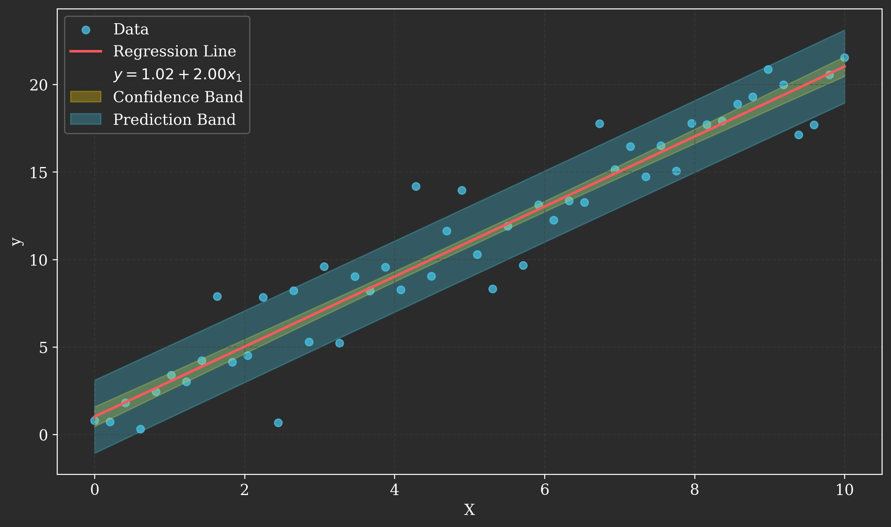
</details>

## Geographical Plots

Located in `chemtools.plots.geographical`.

### Map Plot
```python
from chemtools.plots.geographical.map import MapPlot

# plotter = MapPlot(library='plotly')
# To plot colored regions:
# plotter.plot_choropleth(data, locations_column, values_column, **kwargs)
# To plot points on a map:
# plotter.plot_scatter_geo(data, lat_column, lon_column, **kwargs)
```
-   **Note:** Plotly library is recommended for these plots. To save these plots as static images, you will also need the `kaleido` package (`pip install --upgrade kaleido`).