# Plot Types

This document provides a detailed overview of the various plot types available in the `chemtools` plotting system. Each plot type is organized by category and includes a brief description, a code snippet for usage, and a list of its specific parameters. All plots leverage the `BasePlotter` for consistent theming and backend selection.

## Categorical Plots

For plots specifically designed to handle categorical data, such as heatmaps of co-occurrences and mosaic plots, please see the dedicated documentation:
- [Categorical Data Plots](categorical_plots.md)

## Basic Plots

Located in `chemtools.plots.basic`.

### Bar Plot

The `BarPlot` class can be used to create simple bar charts showing the frequency of categories, or more complex stacked and grouped bar charts to compare values across multiple categories.

[**Details and Examples &raquo;**](basic/bar.md)

```python
from chemtools.plots.basic.bar import BarPlot

# plotter = BarPlot()
# plotter.plot(data, x, y, color=None, mode='group', **kwargs)
```

**Example:**
<picture>
  <source media="(prefers-color-scheme: dark)" srcset="../img/plots/basic/bar_plot_grouped_classic_professional_dark.png">
  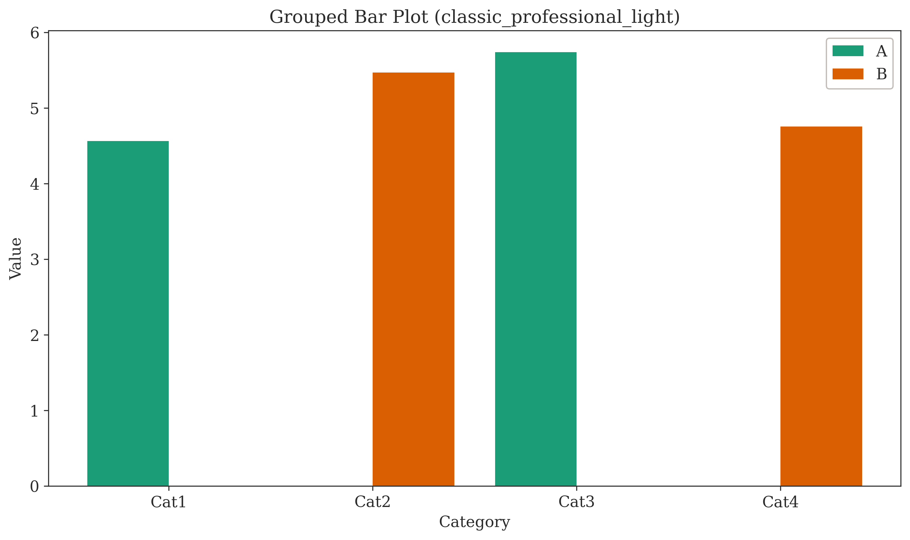
</picture>

### Line Plot

Used for visualizing data points connected by straight line segments. It is especially useful for showing trends in data over time or another continuous interval. The `mode` parameter can also be set to `'dot'` or `'area'`.

[**Details and Examples &raquo;**](basic/line.md)

```python
from chemtools.plots.basic.line import LinePlot

# plotter = LinePlot()
# plotter.plot(data, x_column, y_column, mode='line', **kwargs)
```
-   `mode`: Can be `'line'`, `'dot'`, or `'area'`.

**Example:**
<picture>
  <source media="(prefers-color-scheme: dark)" srcset="../img/plots/basic/line_plot_classic_professional_dark.png">
  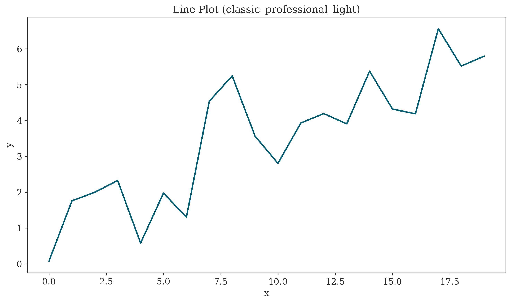
</picture>

### Pie Plot

Pie charts are used to show the proportion of different categories in a dataset. The `hole` parameter can be used to create a donut chart.

[**Details and Examples &raquo;**](basic/pie.md)

```python
from chemtools.plots.basic.pie import PiePlot

# plotter = PiePlot()
# plotter.plot(data, names_column, values_column, hole=0, **kwargs)
```
-   `hole`: Creates a donut chart if > 0.

**Example:**
<picture>
  <source media="(prefers-color-scheme: dark)" srcset="../img/plots/basic/donut_plot_classic_professional_dark.png">
  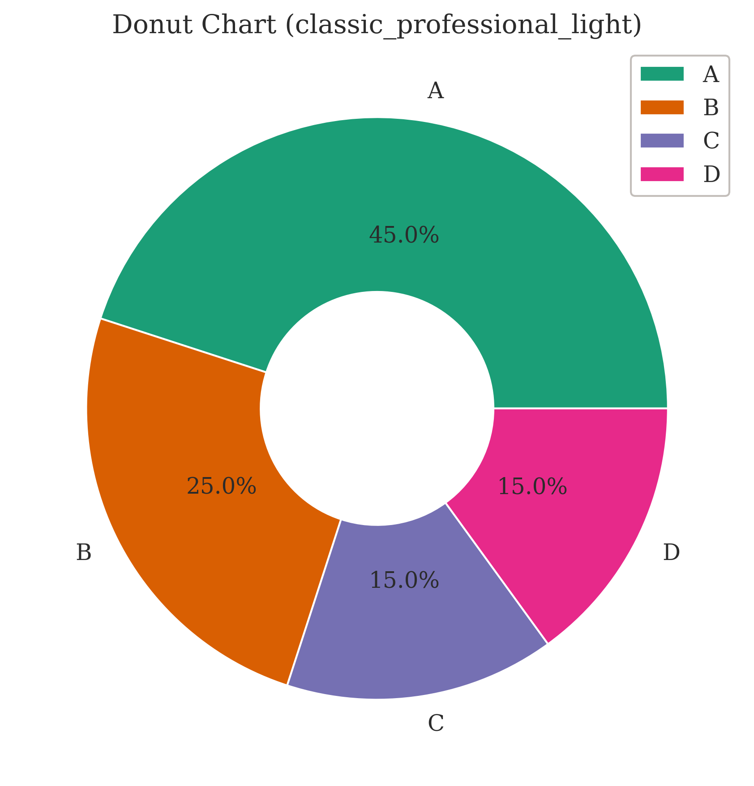
</picture>

## Distribution Plots

Located in `chemtools.plots.distribution`.

### Histogram

A histogram is used to visualize the distribution of a numerical variable by grouping data into bins. The `HistogramPlot` class can also render a smoothed Kernel Density Estimate (KDE) curve.

[**Details and Examples &raquo;**](distribution/histogram.md)

```python
from chemtools.plots.distribution.histogram import HistogramPlot

# plotter = HistogramPlot()
# plotter.plot(data, column, mode='hist', **kwargs)
```
-   `mode`: Can be `'hist'` or `'density'`.

**Example:**
<picture>
  <source media="(prefers-color-scheme: dark)" srcset="../img/plots/distribution/histogram_classic_professional_dark.png">
  
</picture>

### Box Plot

A box plot (or box-and-whisker plot) displays the five-number summary of a set of data. It is very effective for comparing distributions across multiple groups.

[**Details and Examples &raquo;**](distribution/boxplot.md)

```python
from chemtools.plots.distribution.boxplot import BoxPlot

# plotter = BoxPlot()
# plotter.plot(data, y, x=None, **kwargs)
```
-   `y`: The numerical column to plot.
-   `x`: Optional categorical column for grouped plots.

**Example:**
<picture>
  <source media="(prefers-color-scheme: dark)" srcset="../img/plots/distribution/boxplot_classic_professional_dark.png">
  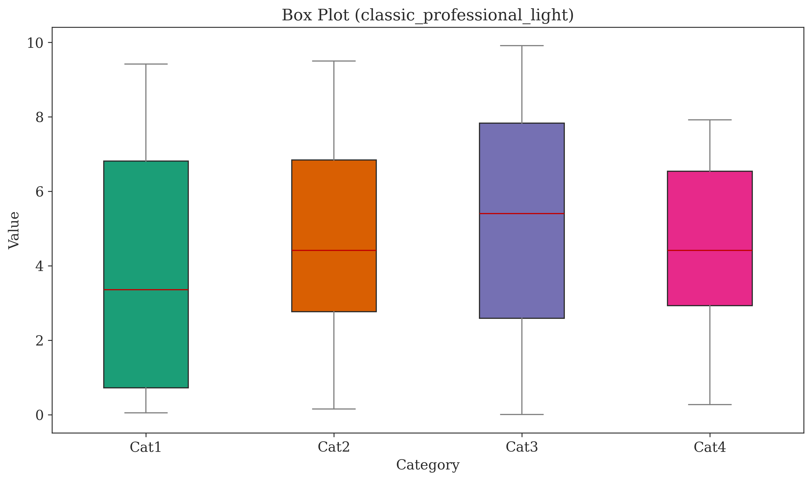
</picture>

### Violin Plot

The violin plot is a powerful visualization that combines a box plot with a kernel density estimate. The `ViolinPlot` in `chemtools` is enhanced with features for showing individual data points (jitter), mean markers, and automatic statistical annotations.

[**Details and Examples &raquo;**](distribution/violin.md)

```python
from chemtools.plots.violin import ViolinPlot

# plotter = ViolinPlot()
# plotter.plot(data, y, x=None, show_jitter=False, **kwargs)
```
-   `y`: The numerical column to plot.
-   `x`: Optional categorical column for grouped plots.
-   `show_jitter` (bool): Adds a "raincloud" of jittered data points.
-   `perform_stat_test` (bool): Automatically performs and annotates pairwise t-tests.

**Example (with jitter and mean):**
<picture>
  <source media="(prefers-color-scheme: dark)" srcset="../img/plots/distribution/violin_plot_classic_professional_dark.png">
  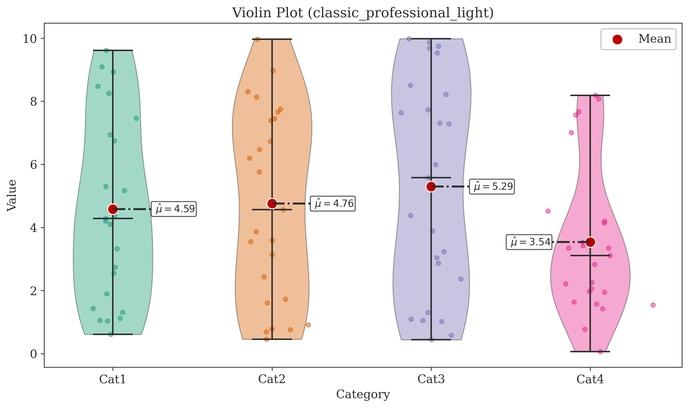
</picture>

### Beeswarm Plot

A beeswarm plot displays individual data points for a numerical variable, arranged to avoid overlap. This "swarming" effect reveals the data's distribution and density, making it a great alternative to a box plot for smaller datasets.

[**Details and Examples &raquo;**](distribution/beeswarm.md)

```python
from chemtools.plots.distribution.beeswarm import BeeswarmPlot

# plotter = BeeswarmPlot()
# plotter.plot(data, x='Category', y='Value', **kwargs)
```
-   `x`: The column name for the categorical variable.
-   `y`: The column name for the numerical variable.

**Example:**
<picture>
  <source media="(prefers-color-scheme: dark)" srcset="../img/examples/beeswarm_demo/beeswarm_plot_dark.png">
  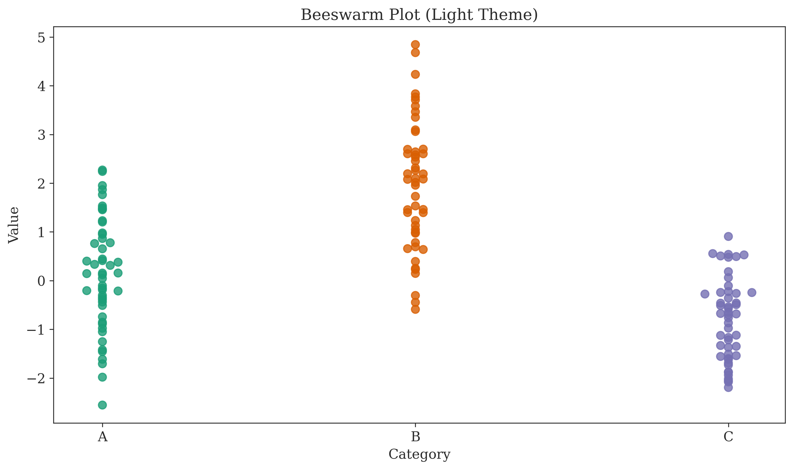
</picture>

### Raincloud Plot

The Raincloud plot provides a comprehensive view of data distributions by combining a violin plot (the "cloud"), a jittered scatter plot (the "rain"), and a box plot.

[**Details and Examples &raquo;**](distribution/raincloud.md)

```python
from chemtools.plots.distribution.raincloud import RaincloudPlot

# plotter = RaincloudPlot()
# plotter.plot(data, x='Category', y='Value', orientation='vertical', **kwargs)
```
-   `orientation` (str): `'vertical'` (default) or `'horizontal'`.

**Example (Vertical):**
<picture>
  <source media="(prefers-color-scheme: dark)" srcset="../img/plots/distribution/raincloud_vertical_classic_professional_dark.png">
  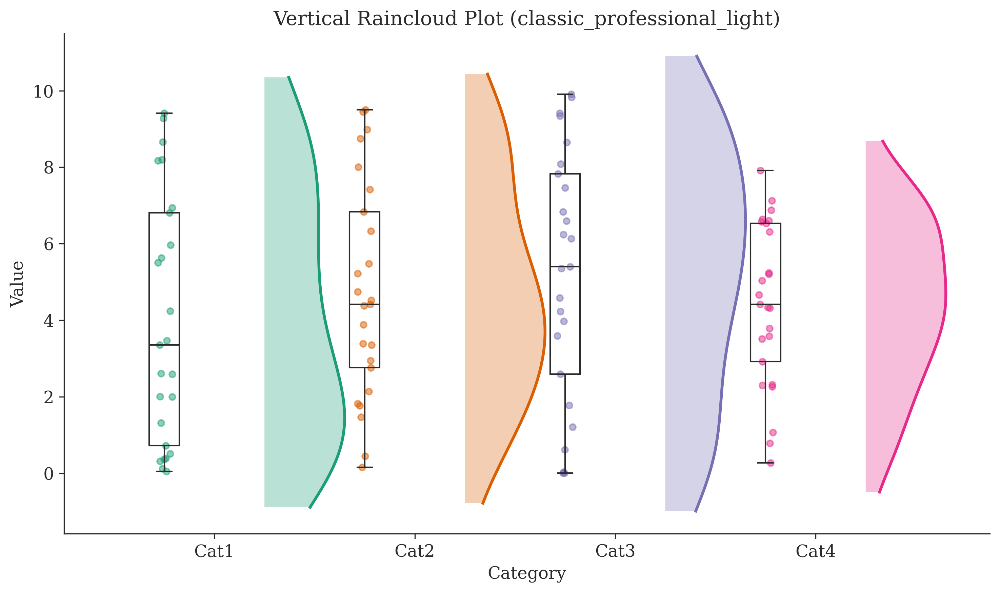
</picture>

### Ridgeline Plot

A ridgeline plot (or joyplot) is used to visualize the distribution of a numerical variable for several groups, arranged in a cascading, overlapping manner. It is excellent for comparing many distributions at once.

[**Details and Examples &raquo;**](distribution/ridgeline.md)

```python
from chemtools.plots.distribution.ridgeline import RidgelinePlot

# plotter = RidgelinePlot()
# plotter.plot(data, x='Value', y='Category', overlap=0.6, **kwargs)
```
- `x`: The column for the numerical variable.
- `y`: The column for the categorical variable that defines the rows.
- `overlap` (float): The degree of vertical overlap between density plots.

**Example:**
<picture>
  <source media="(prefers-color-scheme: dark)" srcset="../img/plots/distribution/ridgeline_simple_classic_professional_dark.png">
  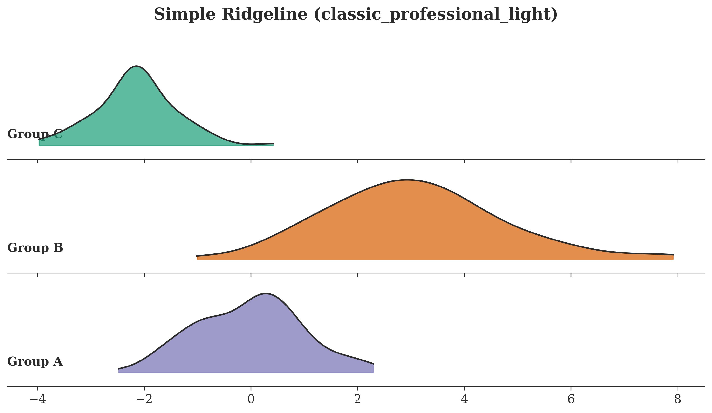
</picture>

## Relationship Plots

Located in `chemtools.plots.relationship`.

### Scatter Plot

Scatter plots are used to visualize the relationship between two or three numerical variables. They are essential for identifying correlation, trends, and outliers. The `ScatterPlot` class supports 2D scatter plots, 3D scatter plots, and bubble charts where a third variable is encoded as the size of the points.

[**Details and Examples &raquo;**](relationship/scatterplot.md)

```python
from chemtools.plots.relationship.scatterplot import ScatterPlot

# plotter = ScatterPlot()
# plotter.plot_2d(data, x_column, y_column, size_column=None, **kwargs)
# plotter.plot_3d(data, x_column, y_column, z_column, **kwargs)
```
-   `size_column`: Creates a bubble chart if provided to `plot_2d`.

**Example:**
<picture>
  <source media="(prefers-color-scheme: dark)" srcset="../img/plots/relationship/scatter_2d_classic_professional_dark.png">
  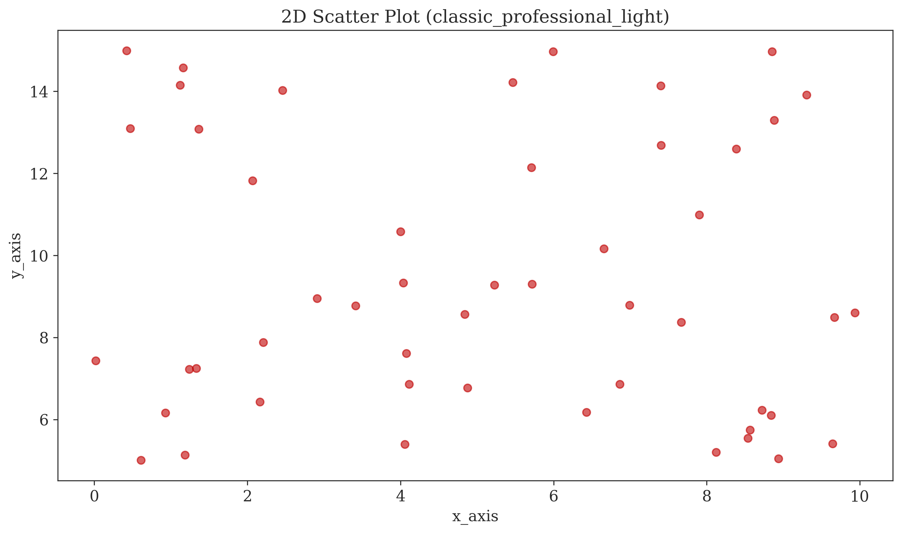
</picture>

### Heatmap

Heatmaps are used to visualize a matrix of data, where individual values are represented as colors. They are particularly useful for displaying correlation matrices or the co-occurrence frequency of categorical variables.

[**Details and Examples &raquo;**](relationship/heatmap.md)

```python
from chemtools.plots.relationship.heatmap import HeatmapPlot

# plotter = HeatmapPlot()
# plotter.plot(data, annot=True, **kwargs)
```
-   `data`: pandas DataFrame representing the matrix to plot.
-   `annot` (bool): If `True`, displays the numerical value on each cell.

**Example (Correlation Matrix):**
<picture>
  <source media="(prefers-color-scheme: dark)" srcset="../img/plots/relationship/heatmap_classic_professional_dark.png">
  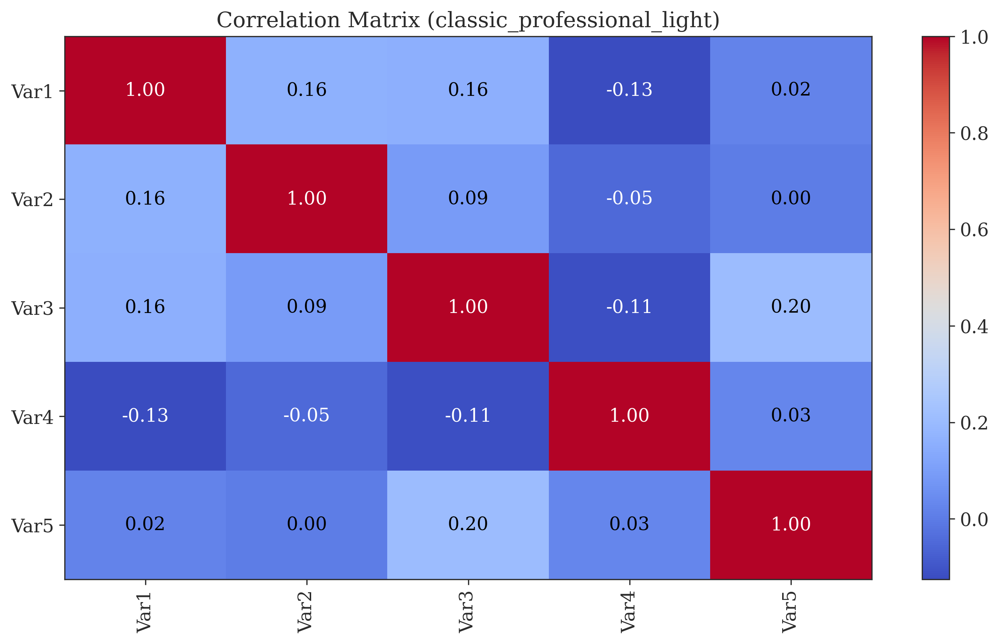
</picture>

### Pair Plot

A pair plot creates a matrix of plots to visualize the pairwise relationships between several variables in a dataset. It's an excellent tool for exploratory data analysis. The `chemtools` implementation provides an advanced version for the matplotlib backend that shows scatter plots, distribution plots (KDE), and correlation coefficients all in one matrix.

[**Details and Examples &raquo;**](relationship/pairplot.md)

```python
from chemtools.plots.relationship.pairplot import PairPlot

# plotter = PairPlot()
# plotter.plot(data, hue=None, **kwargs)
```
- `hue`: A categorical column to color the data points by.

**Example:**
<picture>
  <source media="(prefers-color-scheme: dark)" srcset="../img/plots/relationship/pairplot_classic_professional_dark.png">
  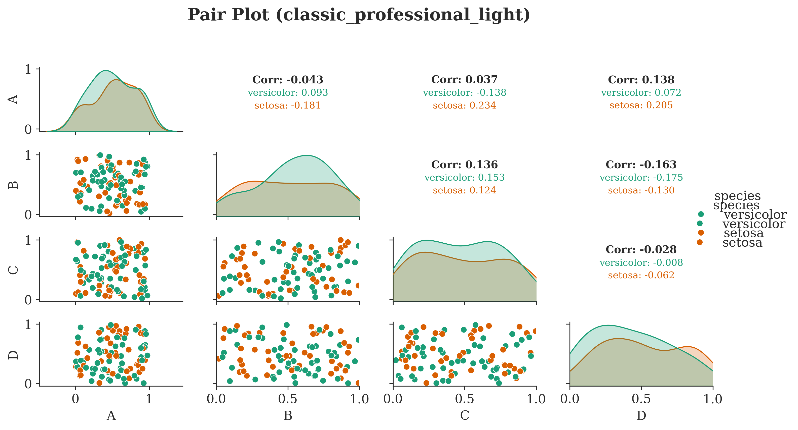
</picture>

### 2D Density Plot

When scatter plots become too crowded due to a large number of data points, a 2D density plot is an excellent alternative. It visualizes the distribution of data points using color to represent density, with options for Kernel Density Estimates (KDE), 2D histograms, and hexbin plots.

[**Details and Examples &raquo;**](relationship/density.md)

```python
from chemtools.plots.relationship.density import DensityPlot

# plotter = DensityPlot()
# plotter.plot(data, x='x_var', y='y_var', kind='kde', **kwargs)
```
- `kind`: The type of density plot, can be `'kde'`, `'hist2d'`, or `'hexbin'`.

**Example (KDE):**
<picture>
  <source media="(prefers-color-scheme: dark)" srcset="../img/plots/relationship/density_kde_dark.png">
  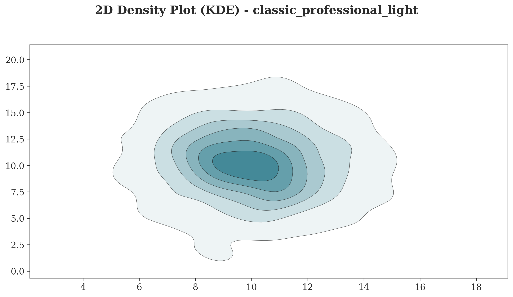
</picture>

### Joint Plot (Marginal Plot)

A joint plot combines a 2D plot (like a scatter plot or 2D KDE) with 1D distribution plots (histograms or KDEs) along its margins, providing a comprehensive view of the relationship between two variables and their individual distributions.

[**Details and Examples &raquo;**](relationship/jointplot.md)

```python
from chemtools.plots.relationship.jointplot import JointPlot

# plotter = JointPlot()
# fig = plotter.plot(data, x='var_a', y='var_b', central_kind='scatter', marginal_kind='hist')
```
- `central_kind`: Type of central plot: `'scatter'` or `'kde2d'`.
- `marginal_kind`: Type of marginal plot: `'hist'` or `'kde1d'`.

**Example (Scatter with Histograms):**
<picture>
  <source media="(prefers-color-scheme: dark)" srcset="../img/plots/relationship/joint_scatter_hist_classic_professional_dark.png">
  
</picture>

## Specialized Plots

Located in `chemtools.plots.specialized`.

### Parallel Coordinates Plot

This plot is used for visualizing high-dimensional data. Each vertical axis represents a different variable, and each colored line represents an observation, showing how it behaves across all variables.

[**Details and Examples &raquo;**](specialized/parallel_coordinates.md)

```python
from chemtools.plots.specialized.parallel_coordinates import ParallelCoordinatesPlot

# plotter = ParallelCoordinatesPlot()
# plotter.plot(data, class_column, **kwargs)
```
-   `class_column`: Column to color the lines by.

**Example:**
<picture>
  <source media="(prefers-color-scheme: dark)" srcset="../img/plots/specialized/parallel_coordinates_plot_classic_professional_dark.png">
  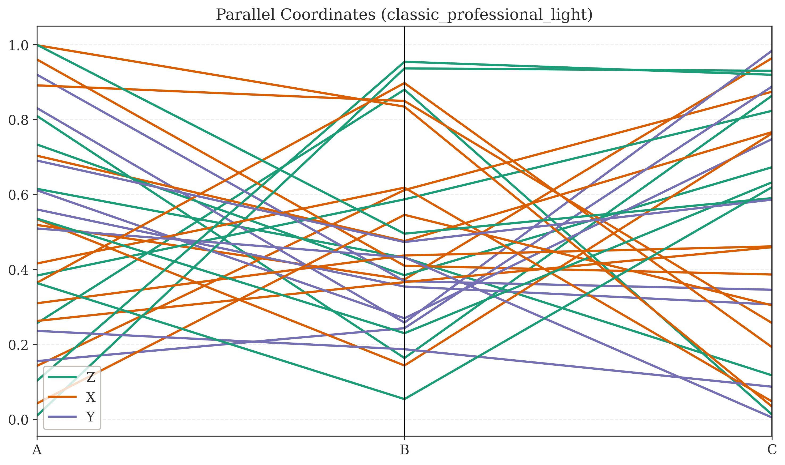
</picture>

### Funnel Chart

A funnel chart is used to visualize the progressive reduction of data as it passes from one phase to another, such as in a sales process.

[**Details and Examples &raquo;**](specialized/funnel.md)

```python
from chemtools.plots.specialized.funnel import FunnelPlot

# plotter = FunnelPlot()
# plotter.plot(data, stage_column, values_column, **kwargs)
```
-   `data`: Should be sorted by funnel stage.

**Example:**
<picture>
  <source media="(prefers-color-scheme: dark)" srcset="../img/plots/specialized/funnel_plot_classic_professional_dark.png">
  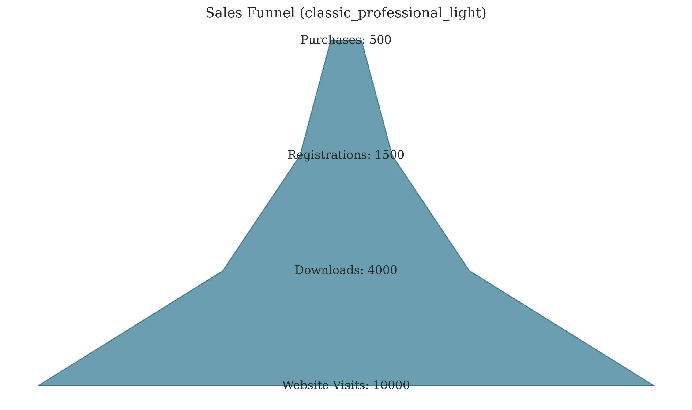
</picture>

### Bullet Chart

A bullet chart compares a primary measure to a target measure and provides context in the form of qualitative performance ranges.

[**Details and Examples &raquo;**](specialized/bullet.md)

```python
from chemtools.plots.specialized.bullet import BulletPlot

# plotter = BulletPlot()
# plotter.plot(value, target, ranges, title, **kwargs)
```
-   `value`, `target`, `ranges`: Numerical inputs for the chart.

**Example:**
<picture>
  <source media="(prefers-color-scheme: dark)" srcset="../img/plots/specialized/bullet_plot_classic_professional_dark.png">
  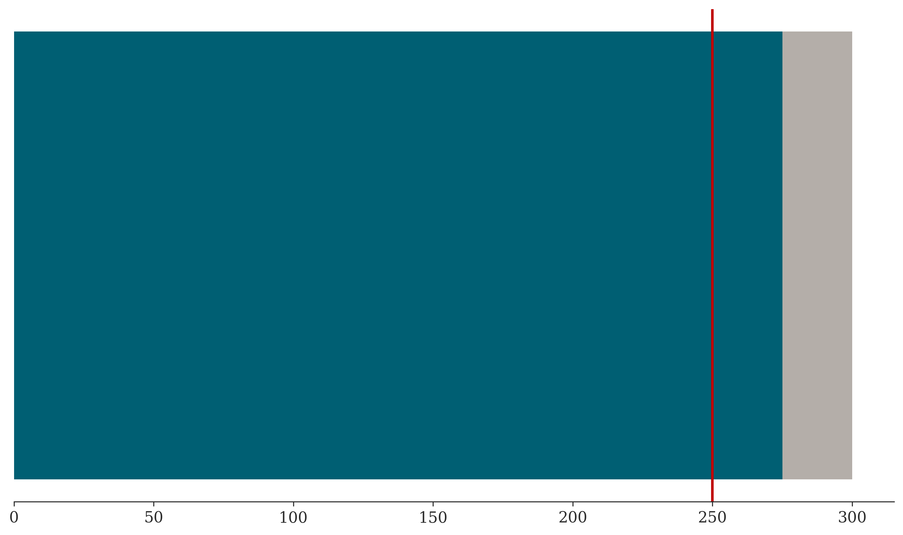
</picture>

### Dual-Axis Chart

This chart allows for the visualization of two different variables with different scales on the same plot, using two separate y-axes.

[**Details and Examples &raquo;**](specialized/dual_axis.md)

```python
from chemtools.plots.specialized.dual_axis import DualAxisPlot

# plotter = DualAxisPlot() # Matplotlib only
# plotter.plot(data, x_column, y1_column, y2_column, **kwargs)
```
-   **Note:** Matplotlib library only.

**Example:**
<picture>
  <source media="(prefers-color-scheme: dark)" srcset="../img/plots/specialized/dual_axis_plot_classic_professional_dark.png">
  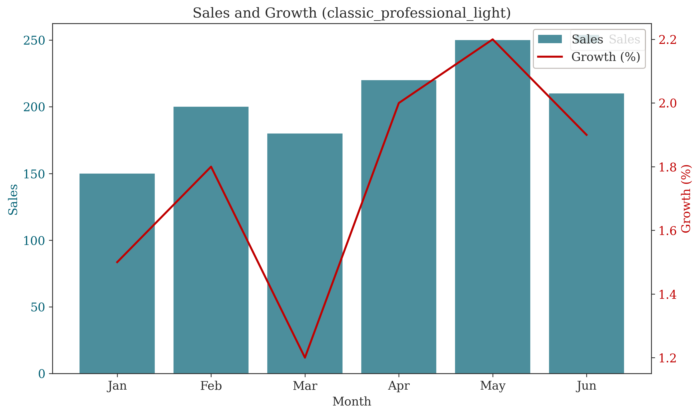
</picture>

### Radar Chart

A radar chart (or spider plot) is a two-dimensional chart type designed to plot one or more series of values over multiple quantitative variables.

[**Details and Examples &raquo;**](specialized/radar.md)

```python
from chemtools.plots.specialized.radar import RadarPlot

# plotter = RadarPlot() # Matplotlib only
# plotter.plot(data, labels, **kwargs)
```
-   **Note:** Matplotlib library only.

**Example:**
<picture>
  <source media="(prefers-color-scheme: dark)" srcset="../img/plots/specialized/radar_plot_dark.png">
  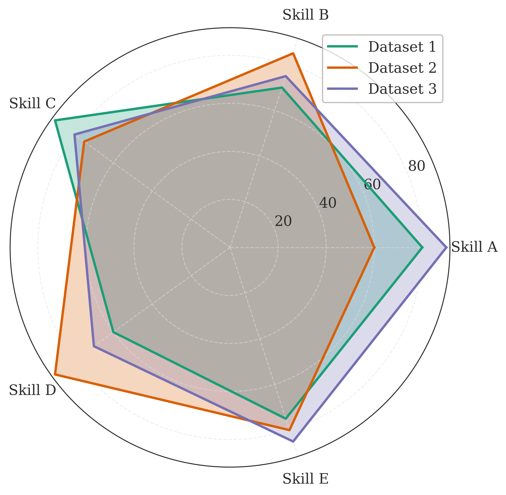
</picture>

## Clustering Plots

Located in `chemtools.plots.clustering`.

### Dendrogram

A dendrogram is a tree-like diagram that records the sequences of merges or splits in a hierarchical clustering. It shows how clusters are related to one another and is the primary way to visualize the output of hierarchical clustering.

[**Details and Examples &raquo;**](clustering/dendrogram.md)

```python
from chemtools.clustering import HierarchicalClustering
from chemtools.plots.clustering import DendrogramPlotter

# model = HierarchicalClustering(X).fit()
# plotter = DendrogramPlotter()
# plotter.plot_dendrogram(model, **kwargs)
```

**Example:**
<picture>
  <source media="(prefers-color-scheme: dark)" srcset="../img/plots/clustering/dendrogram_classic_professional_dark.png">
  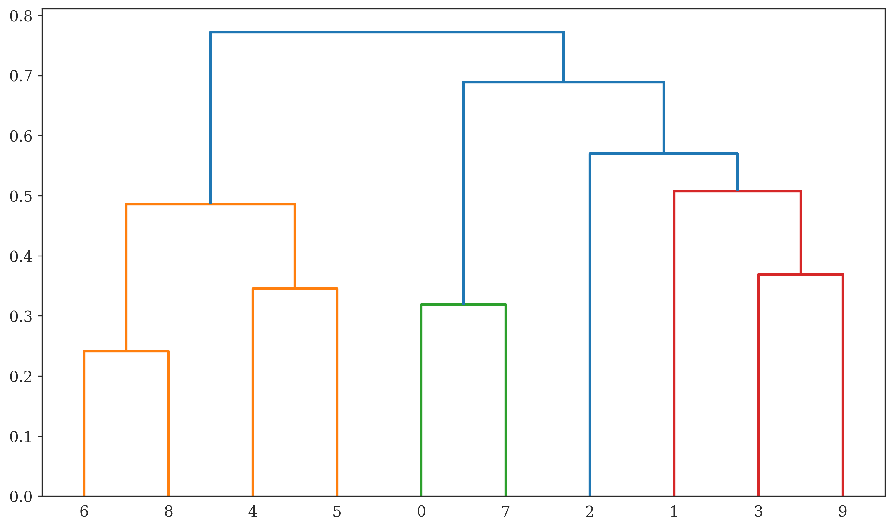
</picture>

## Temporal Plots

Located in `chemtools.plots.temporal`.

### Run Chart

A run chart is a line graph of data plotted over time. It is used to find trends or patterns in the data.

[**Details and Examples &raquo;**](temporal/run_chart.md)

```python
from chemtools.plots.temporal.run_chart import RunChartPlot

# plotter = RunChartPlot()
# plotter.plot(data, time_column, value_column, **kwargs)
```

**Example:**
<picture>
  <source media="(prefers-color-scheme: dark)" srcset="../img/plots/temporal/run_chart_classic_professional_dark.png">
  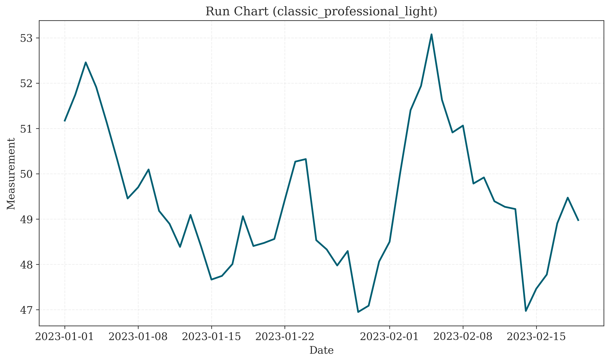
</picture>

## Regression Plots

Located in `chemtools.plots.regression`.

### Regression Results Plot

This plot provides a comprehensive visualization of a linear regression model, showing the original data points, the fitted regression line, and the confidence and prediction bands.

[**Details and Examples &raquo;**](regression/regression.md)

```python
from chemtools.regression import OLSRegression
from chemtools.plots.regression import RegressionPlots

# model = OLSRegression().fit(X, y)
# plotter = RegressionPlots(model)
# plotter.plot_regression_results(**kwargs)
```

**Example:**
<picture>
  <source media="(prefers-color-scheme: dark)" srcset="../img/plots/regression/regression_results_classic_professional_dark.png">
  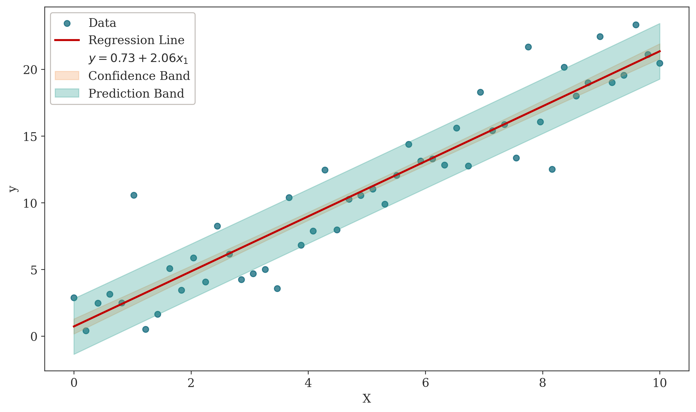
</picture>

### Regression Component Visualizations

The `plot_regression_results` function provides a comprehensive visualization of a linear regression model.

<picture>
  <source media="(prefers-color-scheme: dark)" srcset="../img/plots/regression/regression_results_classic_professional_dark.png">
  
</picture>

## Geographical Plots

Located in `chemtools.plots.geographical`.

### Map Plot

Geographical plots are used to visualize data on a map. This includes choropleth maps, where regions are colored based on a value, and geo scatter plots, which place points at specific latitude/longitude coordinates.

[**Details and Examples &raquo;**](geographical/map.md)

```python
from chemtools.plots.geographical.map import MapPlot

# plotter = MapPlot(library='plotly')
# plotter.plot_choropleth(data, locations_column, values_column, **kwargs)
```
-   **Note:** Plotly library is recommended for these plots.

**Example (Choropleth):**
<picture>
  <source media="(prefers-color-scheme: dark)" srcset="../img/plots/geographical/choropleth_map.png">
  
</picture>

## Exploration Plots

Located in `chemtools.plots.exploration`. These plots are designed to visualize the results of specific multivariate analysis techniques.

### Factor Analysis for Mixed Data (FAMD) Plots

FAMD is a principal component method for datasets containing both numerical and categorical variables. These plots visualize the results.

[**Details and Examples &raquo;**](exploration/famd.md)

**Example (Scores Plot):**
<picture>
  <source media="(prefers-color-scheme: dark)" srcset="../img/dimensional_reduction/famd/famd_scores_classic_professional_dark.png">
  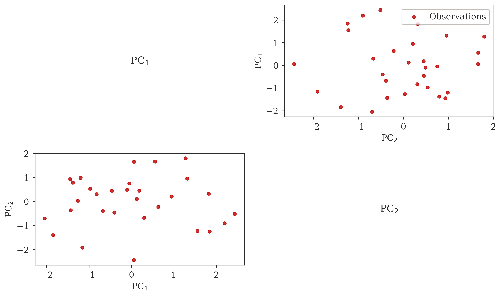
</picture>

### Multiple Correspondence Analysis (MCA) Plots

MCA is used to analyze patterns in categorical data. These plots visualize the relationships between categories and observations.

[**Details and Examples &raquo;**](exploration/mca.md)

**Example (Objects Plot):**
<picture>
  <source media="(prefers-color-scheme: dark)" srcset="../img/exploration/mca/mca_objects_classic_professional_dark.png">
  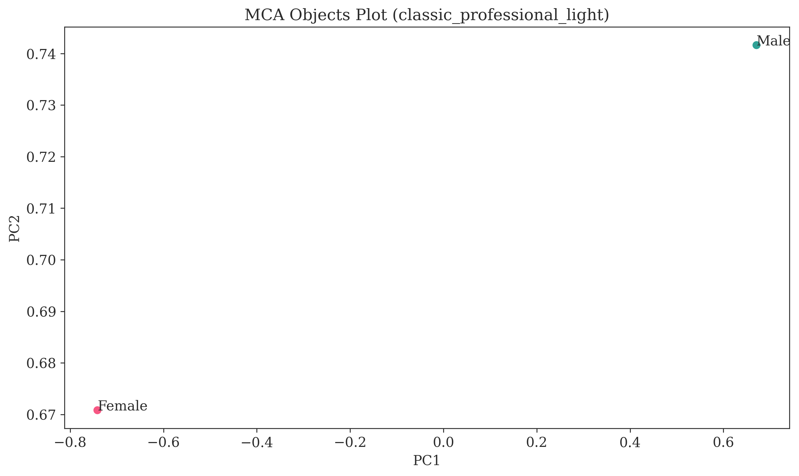
</picture>

### Principal Component Analysis (PCA) Plots

PCA plots are fundamental for visualizing the results of PCA, including biplots, loadings, scores, and scree plots.

[**Details and Examples &raquo;**](exploration/pca.md)

**Example (Biplot):**
<picture>
  <source media="(prefers-color-scheme: dark)" srcset="../img/exploration/pca/pca_biplot_classic_professional_dark.png">
  
</picture>