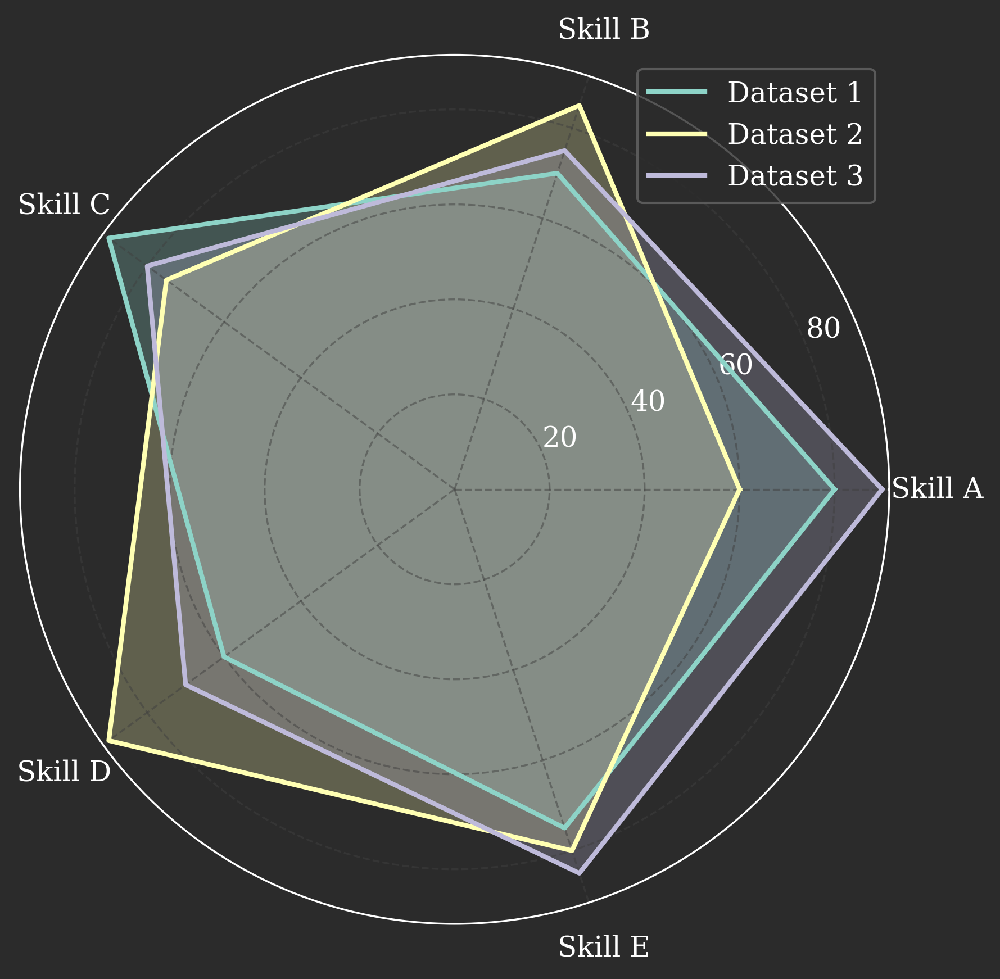

# Radar Chart

A radar chart (also known as a spider plot or star chart) is a two-dimensional chart designed to plot one or more series of values over multiple quantitative variables. Each variable has its own axis, and all axes are joined in the center of the plot.

## `plot`

This is the primary method for creating radar charts.

### Usage
```python
from chemtools.plots.specialized import RadarPlot
import pandas as pd

# Sample Data
data = pd.DataFrame({
    'Skill A': [80, 60, 90],
    'Skill B': [70, 85, 75],
    'Skill C': [90, 75, 80],
    'Skill D': [60, 90, 70],
    'Skill E': [75, 80, 85],
})

# Light theme radar chart
plotter_light = RadarPlot(theme='classic_professional_light')
fig_light = plotter_light.plot(data, fill=True)
fig_light.savefig("radar_light.png")

# Dark theme radar chart
plotter_dark = RadarPlot(theme='classic_professional_dark', tick_label_padding=15)
fig_dark = plotter_dark.plot(data, fill=True)
fig_dark.savefig("radar_dark.png")
```

### Parameters
- `data` (pd.DataFrame): The input DataFrame. Each row represents a dataset, and each column an axis.
- `labels` (list, optional): Labels for each axis. If None, column names of the DataFrame are used.
- `fill` (bool, optional): Whether to fill the area under the lines. Defaults to `False`.
- `tick_label_padding` (int, optional): Padding for the tick labels. Defaults to `10`.
- `**kwargs`: Additional keyword arguments passed to the `BasePlotter`.

### Example Output (Light Theme)
<picture>
  <source media="(prefers-color-scheme: dark)" srcset="../../img/plots/specialized/radar_plot_dark.png">
  
</picture>

### Example Output (Dark Theme)
<picture>
  <source media="(prefers-color-scheme: dark)" srcset="../../img/plots/specialized/radar_plot_dark.png">
  
</picture>
