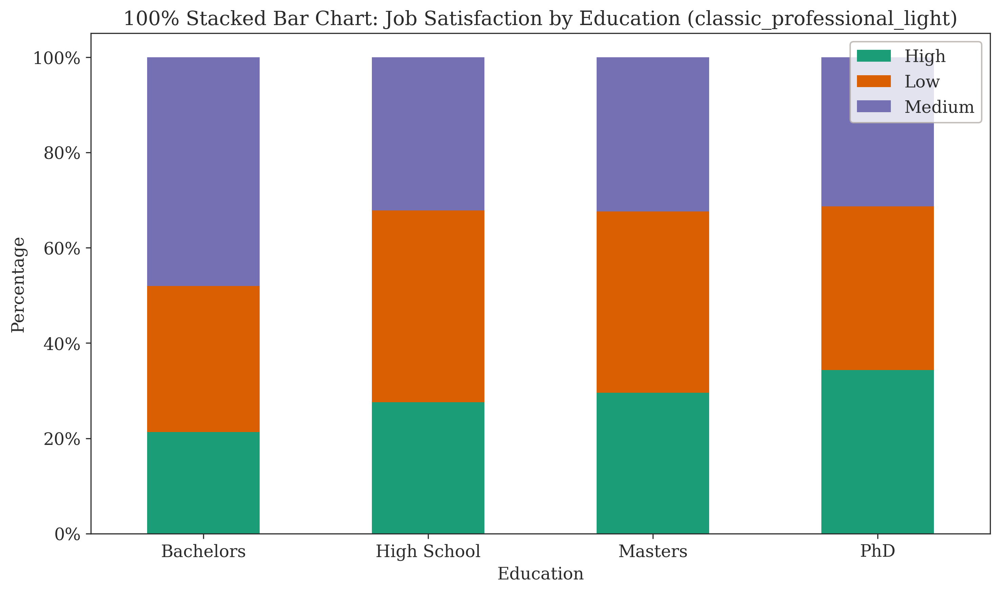
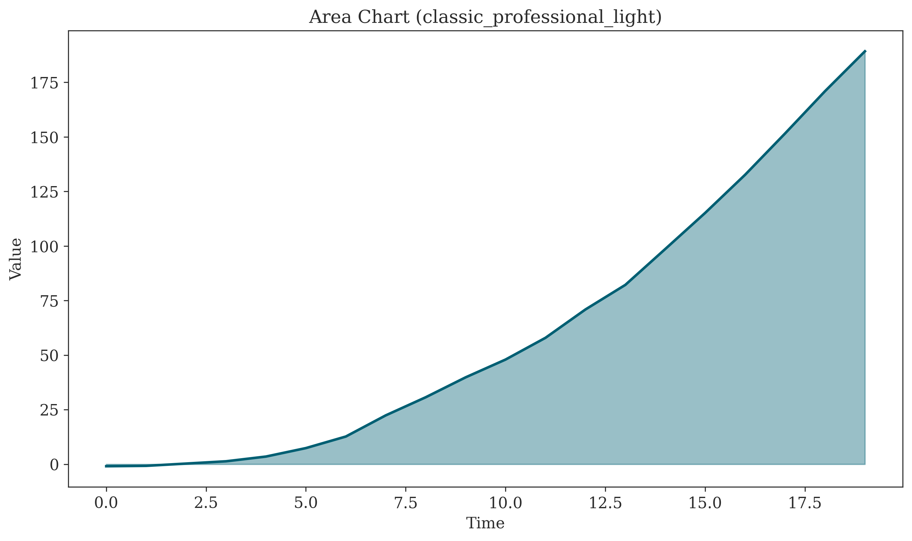
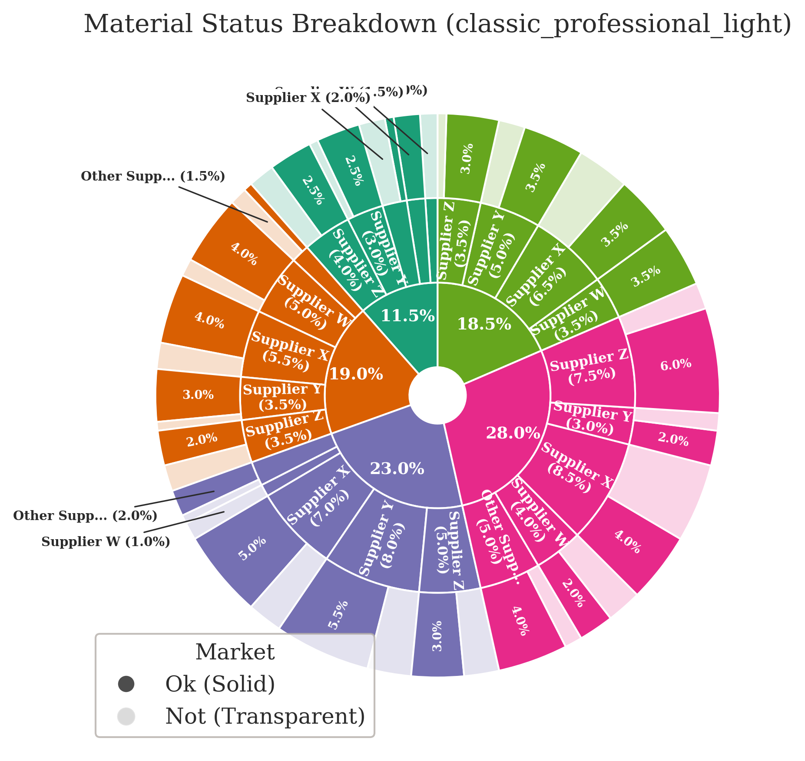
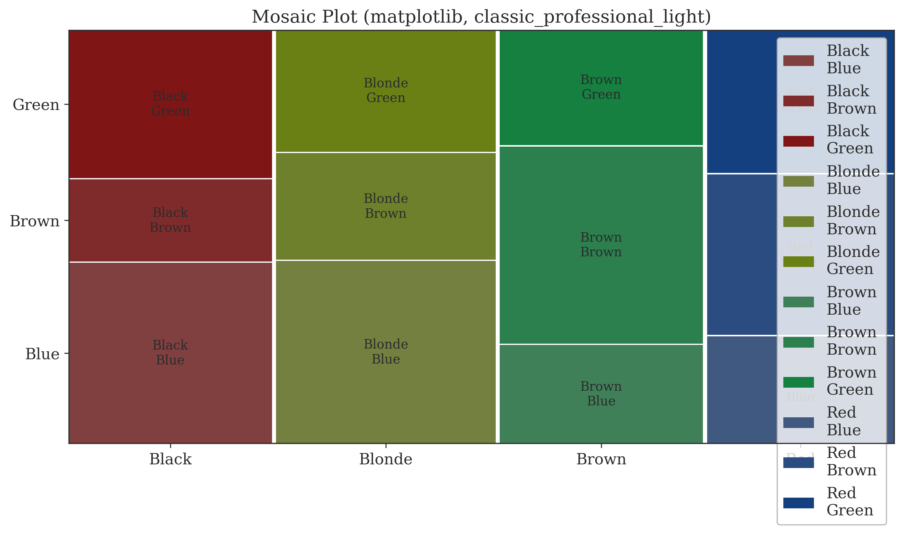
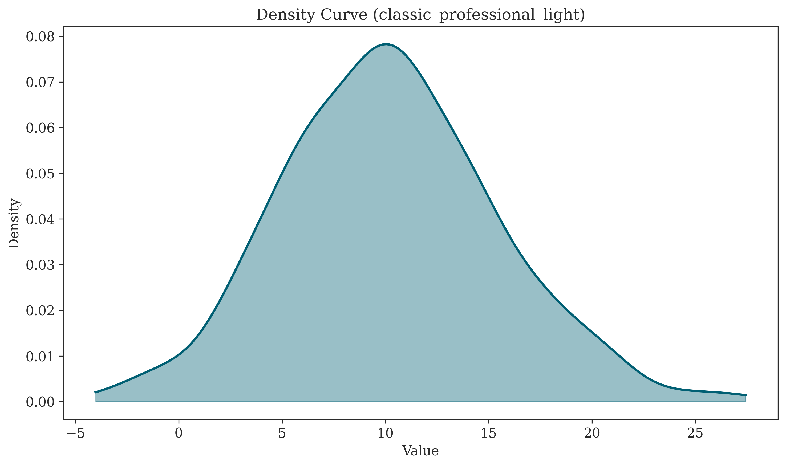
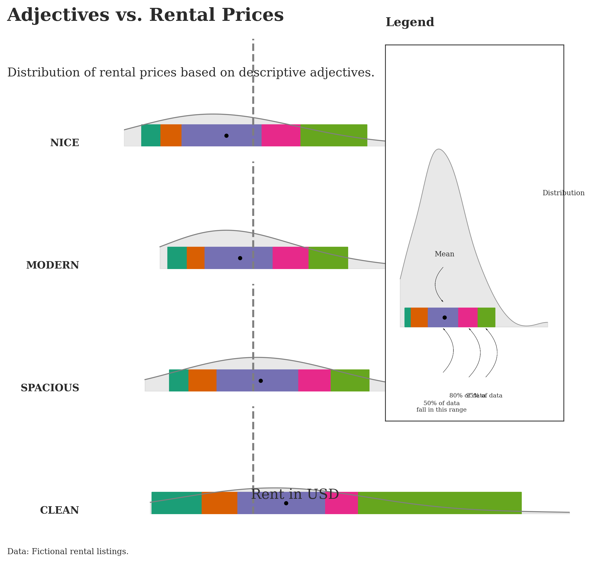
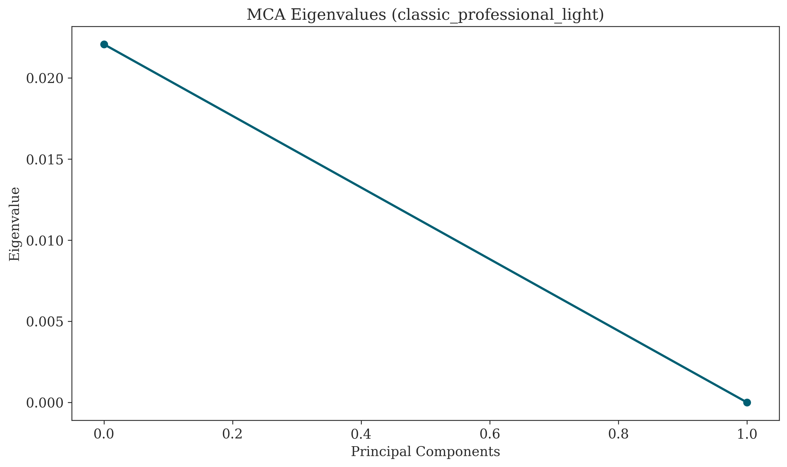
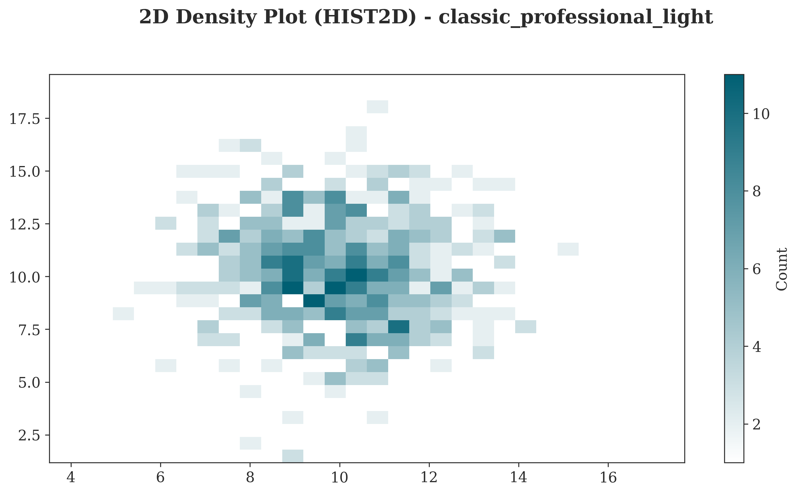
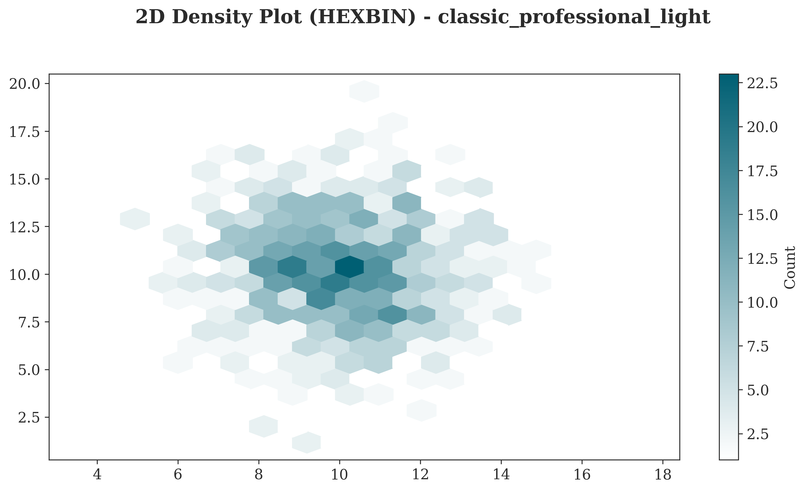
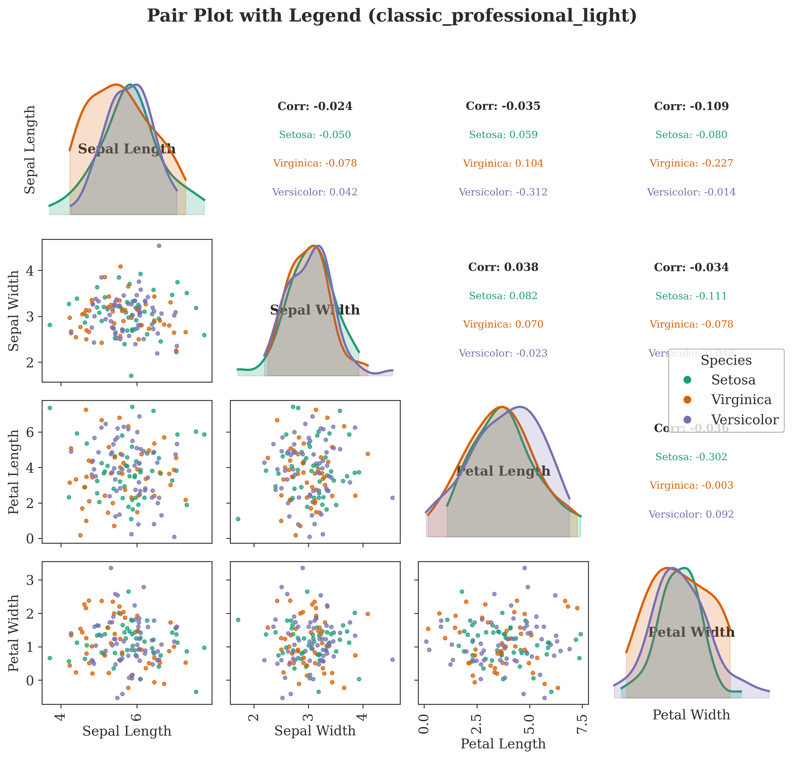

# Plotting System API Reference (`chemtools.plots`)

This document provides detailed API references, usage examples, and parameters for all plotting classes and methods available in the `chemtools` library. All plotting classes inherit from `BasePlotter`, which handles consistent theming and backend selection (Matplotlib or Plotly).

---

## `BasePlotter` Class (Parent Class for All Plotters)

All plot classes in `chemtools.plots` inherit from `BasePlotter`.

### `BasePlotter(library="matplotlib", theme="light", style_preset="default", figsize=(10, 6), title=None, xlabel=None, ylabel=None, subplot_title=None, showlegend=True, watermark=None, watermark_alpha=0.1, **kwargs)`

*   **Parameters:**
    *   `library` (`str`, optional): The plotting backend to use: `"matplotlib"` or `"plotly"`. Defaults to `"matplotlib"`.
    *   `theme` (`str`, optional): The theme to apply (e.g., `"light"`, `"dark"`, `"oceanic_slate_light"`). Defaults to `"light"`.
    *   `style_preset` (`str`, optional): A predefined style configuration (e.g., `"default"`, `"minimal"`). Defaults to `"default"`.
    *   `figsize` (`tuple`, optional): Figure size for Matplotlib plots `(width, height)` in inches.
    *   `title` (`str`, optional): Main title for the entire figure.
    *   `xlabel` (`str`, optional): Label for the x-axis.
    *   `ylabel` (`str`, optional): Label for the y-axis.
    *   `subplot_title` (`str`, optional): Title for individual subplots.
    *   `showlegend` (`bool`, optional): Whether to display the legend. Defaults to `True`.
    *   `watermark` (`str`, optional): Text for an optional watermark.
    *   `watermark_alpha` (`float`, optional): Transparency of the watermark.
    *   `**kwargs`: Additional keyword arguments passed to the underlying plotting library.

---

## Basic Plots (`chemtools.plots.basic`)

### Bar Plot (`BarPlot`)

Bar plots represent categorical data with rectangular bars, comparing values across different groups.

#### `BarPlot()`
*   **Parameters:** None (inherits from `BasePlotter`)

#### Methods

*   **`plot_counts(self, data: pd.DataFrame, column: str, **kwargs)`**
    *   Visualizes the frequency (count) of each category in a single column.
    *   **Parameters:**
        *   `data` (`pd.DataFrame`): The input DataFrame.
        *   `column` (`str`): The column for which to plot counts.
    *   **Example Output:**
        <picture>
          <source media="(prefers-color-scheme: dark)" srcset="../img/plots/basic/bar_plot_counts_classic_professional_dark.png">
          
        </picture>

*   **`plot(self, data: pd.DataFrame, x: str, y: str, color: str = None, mode: str = 'group', **kwargs)`**
    *   Creates grouped or stacked bar charts.
    *   **Parameters:**
        *   `data` (`pd.DataFrame`): The input DataFrame.
        *   `x` (`str`): Column for the main categories on the x-axis.
        *   `y` (`str`): Numerical column for bar heights.
        *   `color` (`str`, optional): Column to group by and color the bars.
        *   `mode` (`str`): `'group'` for grouped bars or `'stack'` for stacked bars.
    *   **Example Output (Grouped):**
        <picture>
          <source media="(prefers-color-scheme: dark)" srcset="../img/plots/basic/bar_plot_grouped_classic_professional_dark.png">
          
        </picture>

*   **`plot_crosstab(self, crosstab_data: pd.DataFrame, stacked: bool = True, normalize: bool = False, **kwargs)`**
    *   Plots wide-format data (e.g., from `pd.crosstab`).
    *   **Parameters:**
        *   `crosstab_data` (`pd.DataFrame`): Wide-format DataFrame.
        *   `stacked` (`bool`): If `True`, creates a stacked bar chart.
        *   `normalize` (`bool`): If `True` and `stacked` is `True`, creates a 100% stacked bar chart.
    *   **Example Output (100% Stacked):**
        <picture>
          <source media="(prefers-color-scheme: dark)" srcset="../img/plots/categorical/stacked_bar_chart_classic_professional_dark.png">
          
        </picture>

### Line Plot (`LinePlot`)

Visualizes data points connected by straight line segments, suitable for trends.

#### `LinePlot()`
*   **Parameters:** None (inherits from `BasePlotter`)

#### Methods

*   **`plot(self, data: pd.DataFrame, x_column: str, y_column: str, mode: str = 'line', **kwargs)`**
    *   Creates line, dot, or area plots.
    *   **Parameters:**
        *   `data` (`pd.DataFrame`): The input DataFrame.
        *   `x_column` (`str`): Column for the x-axis.
        *   `y_column` (`str`): Column for the y-axis.
        *   `mode` (`str`): Type of plot: `'line'`, `'dot'`, or `'area'`.
    *   **Example Output (Line):**
        <picture>
          <source media="(prefers-color-scheme: dark)" srcset="../img/plots/basic/line_plot_classic_professional_dark.png">
          
        </picture>
    *   **Example Output (Area):**
        <picture>
          <source media="(prefers-color-scheme: dark)" srcset="../img/plots/basic/area_plot_classic_professional_dark.png">
          
        </picture>

### Pie Plot (`PiePlot`)

Illustrates numerical proportion with circular graphics, also supports donut charts.

#### `PiePlot()`
*   **Parameters:** None (inherits from `BasePlotter`)

#### Methods

*   **`plot(self, data: pd.DataFrame, names_column: str, values_column: str, hole: float = 0, **kwargs)`**
    *   Creates a pie or donut chart.
    *   **Parameters:**
        *   `data` (`pd.DataFrame`): The input DataFrame.
        *   `names_column` (`str`): Column with slice names.
        *   `values_column` (`str`): Column with slice values.
        *   `hole` (`float`): Size of the hole for a donut chart (0 to 1). `0` for pie chart.
    *   **Example Output (Pie):**
        <picture>
          <source media="(prefers-color-scheme: dark)" srcset="../img/plots/basic/pie_plot_classic_professional_dark.png">
          
        </picture>
    *   **Example Output (Donut):**
        <picture>
          <source media="(prefers-color-scheme: dark)" srcset="../img/plots/basic/donut_plot_classic_professional_dark.png">
          
        </picture>

### Sunburst Plot (`SunburstPlot`)

Multi-layered pie charts for hierarchical data.

#### `SunburstPlot()`
*   **Parameters:** None (inherits from `BasePlotter`)

#### Methods

*   **`plot(self, df: pd.DataFrame, cols: List[str], count_col: str, status_col: str, status_ok_val: str, start_angle: int = 90, top_n_limits: Tuple[int, int] = (6, 10), label_color: str = 'black', **kwargs)`**
    *   Generates a multi-layered sunburst chart.
    *   **Parameters:**
        *   `df` (`pd.DataFrame`): Input DataFrame.
        *   `cols` (`List[str]`): List of 2 column names for hierarchy.
        *   `count_col` (`str`): Column whose unique values count for segment sizes.
        *   `status_col` (`str`): Column determining segment transparency.
        *   `status_ok_val` (`str`): Value in `status_col` for full opacity.
        *   `start_angle` (`int`): Starting angle in degrees.
        *   `top_n_limits` (`Tuple[int, int]`): (Top N for Layer 1, Top N for Layer 2).
        *   `label_color` (`str`): Color of text labels.
    *   **Example Output:**
        <picture>
          <source media="(prefers-color-scheme: dark)" srcset="../img/plots/basic/sunburst_plot_classic_professional_dark.png">
          
        </picture>

---

<h2>Categorical Plots</h2>

### Mosaic Plot

A mosaic plot is a graphical representation of a contingency table. The `chemtools` implementation uses `statsmodels` for the `matplotlib` backend.

<h4><code>MosaicPlot()</code></h4>

*   <b>Parameters:</b> None (inherits from `BasePlotter`)

<h4>Methods</h4>

*   <b><code>plot(self, data: pd.DataFrame, columns: List[str], **kwargs)</code></b>
    *   Generates a mosaic plot.
    *   <b>Parameters:</b>
        *   `data` (`pd.DataFrame`): Input DataFrame.
        *   `columns` (`List[str]`): List of categorical columns to plot.
    *   <b>Example Output:</b>
        <picture>
          <source media="(prefers-color-scheme: dark)" srcset="../img/plots/categorical/mosaic_plot_mpl_classic_professional_dark.png">
          
        </picture>

---

<h2>Classification Plots</h2>

### SIMCA Plot (`SIMCAPlot`)

Visualizes the results of a Soft Independent Modeling of Class Analogies (`SIMCA`) model.

<h4><code>SIMCAPlot(simca_model)</code></h4>

*   <b>Parameters:</b>
    *   `simca_model`: A fitted `SIMCA` object.

<h4>Methods</h4>

*   <b><code>plot_scores(self, components: tuple = (0, 1), confidence_level: float = 0.95, show_legend: bool = True, **kwargs)</code></b>
    *   Plots the scores of each class model, typically with confidence ellipses.
    *   <b>Parameters:</b>
        *   `components` (`tuple`): Two principal components to plot on x and y axes. Defaults to `(0, 1)`.
        *   `confidence_level` (`float`): Confidence level for ellipses. Defaults to `0.95`.
        *   `show_legend` (`bool`): Whether to display legend.
    *   <b>Example Output:</b>
        <picture>
          <source media="(prefers-color-scheme: dark)" srcset="../img/plots/classification/simca_scores_plot_dark.png">
          
        </picture>

---

<h2>Clustering Plots</h2>

### Dendrogram Plot (`DendrogramPlotter`)

A tree-like diagram representing the hierarchy of clusters.

<h4><code>DendrogramPlotter()</code></h4>

*   <b>Parameters:</b> None (inherits from `BasePlotter`)

<h4>Methods</h4>

*   <b><code>plot_dendrogram(self, model, orientation="top", labels=None, color_threshold=None, **kwargs)</code></b>
    *   Generates a dendrogram from a fitted `HierarchicalClustering` model.
    *   <b>Parameters:</b>
        *   `model`: A fitted `HierarchicalClustering` object.
        *   `orientation` (`str`): `'top'` (default), `'bottom'`, `'left'`, or `'right'`.
        *   `labels` (`list`): Labels for dendrogram leaves.
        *   `color_threshold` (`float`): Threshold for coloring clusters.
    *   <b>Example Output:</b>
        <picture>
          <source media="(prefers-color-scheme: dark)" srcset="../img/plots/clustering/dendrogram_classic_professional_dark.png">
          
        </picture>

---

<h2>Composite Plots</h2>

### GridPlotter (`GridPlotter`)

Provides a flexible framework for arranging multiple `chemtools` plotters into a single, dynamic grid layout.

<h4><code>GridPlotter(nrows: int, ncols: int, width_ratios: List[float] = None, height_ratios: List[float] = None, subplot_titles: List[str] = None, **kwargs)</code></h4>

*   <b>Parameters:</b>
    *   `nrows` (`int`): Number of rows.
    *   `ncols` (`int`): Number of columns.
    *   `width_ratios` (`List[float]`, optional): Ratios of subplot widths.
    *   `height_ratios` (`List[float]`, optional): Ratios of subplot heights.
    *   `subplot_titles` (`List[str]`, optional): Titles for each subplot.
    *   `**kwargs`: Additional keyword arguments for `BasePlotter`.

<h4>Methods</h4>

*   <b><code>add_plot(self, row: int, col: int, plotter_instance, plot_method_name: str, data: pd.DataFrame, **plot_kwargs)</code></b>
    *   Adds a plot to a specific grid cell.
    *   <b>Parameters:</b>
        *   `row` (`int`): Row index (0-indexed).
        *   `col` (`int`): Column index (0-indexed).
        *   `plotter_instance`: An instance of a `chemtools` plotter class.
        *   `plot_method_name` (`str`): Name of the plotting method to call.
        *   `data` (`pd.DataFrame`): Data for the plotting method.
        *   `**plot_kwargs`: Keyword arguments for the plotting method.

*   <b><code>render(self) -> Figure</code></b>
    *   Renders the combined grid plot.

<h4>Usage Example</h4>

```python
from chemtools.plots.composite import GridPlotter
from chemtools.plots.basic import BarPlot, LinePlot, PiePlot
from chemtools.plots.relationship import ScatterPlot # Assuming ScatterPlot is imported
import pandas as pd
import numpy as np

# Initialize GridPlotter
grid_plotter = GridPlotter(nrows=2, ncols=2, figsize=(12, 8), 
                           subplot_titles=["Category Counts", "Time Series", "Scatter Plot", "Task Progress"],
                           theme='classic_professional_light')

# Sample Data
data1 = pd.DataFrame({'Category': ['A', 'B', 'C'], 'Value': [10, 15, 7]})
data2 = pd.DataFrame({'Time': np.arange(10), 'Value': np.random.randn(10).cumsum()})
data3 = pd.DataFrame({'X': np.random.rand(50), 'Y': np.random.rand(50)})
data4 = pd.DataFrame({'Task': ['T1', 'T2'], 'Progress': [80, 50]})

# Create plotter instances
bar_plotter = BarPlot()
line_plotter = LinePlot()
scatter_plotter = ScatterPlot()
pie_plotter = PiePlot()

# Add plots to specific grid cells
grid_plotter.add_plot(row=0, col=0, plotter_instance=bar_plotter, plot_method_name='plot_counts', 
                      data=data1, column='Category')
grid_plotter.add_plot(row=0, col=1, plotter_instance=line_plotter, plot_method_name='plot', 
                      data=data2, x_column='Time', y_column='Value')
grid_plotter.add_plot(row=1, col=0, plotter_instance=scatter_plotter, plot_method_name='plot_2d', 
                      data=data3, x_column='X', y_column='Y')
grid_plotter.add_plot(row=1, col=1, plotter_instance=pie_plotter, plot_method_name='plot', 
                      data=data4, names_column='Task', values_column='Progress')

# Render the grid
fig = grid_plotter.render()
# fig.savefig("grid_plot_example.png", bbox_inches='tight') # Uncomment to save
```

#### Example Output
<picture>
  <source media="(prefers-color-scheme: dark)" srcset="../img/plots/composite/grid_plotter_example_classic_professional_dark.png">
  
</picture>

---

<h2>Distribution Plots (`chemtools.plots.distribution`)</h2>

### Beeswarm Plot (`BeeswarmPlot`)

Displays individual data points for a numerical variable, arranged to avoid overlap.

<h4><code>BeeswarmPlot()</code></h4>

*   <b>Parameters:</b> None (inherits from `BasePlotter`)

<h4>Methods</h4>

*   <b><code>plot(self, data: pd.DataFrame, x: str, y: str, orientation: str = 'vertical', point_size: int = 50, spread_factor: float = 0.05, **kwargs)</code></b>
    *   Generates a Beeswarm plot.
    *   <b>Parameters:</b>
        *   `data` (`pd.DataFrame`): The input DataFrame.
        *   `x` (`str`): Column for the categorical variable.
        *   `y` (`str`): Column for the numerical variable.
        *   `orientation` (`str`): `'vertical'` (default).
        *   `point_size` (`int`): Size of scatter points.
        *   `spread_factor` (`float`): Controls horizontal spread.
    *   <b>Example Output:</b>
        <picture>
          <source media="(prefers-color-scheme: dark)" srcset="../img/plots/distribution/beeswarm_plot_classic_professional_dark.png">
          
        </picture>

### Box Plot (`BoxPlot`)

Displays the five-number summary of data, effective for comparing distributions.

<h4><code>BoxPlot()</code></h4>

*   <b>Parameters:</b> None (inherits from `BasePlotter`)

<h4>Methods</h4>

*   <b><code>plot(self, data: pd.DataFrame, y: str, x: str = None, mode: str = 'box', **kwargs)</code></b>
    *   Creates a box plot or violin plot.
    *   <b>Parameters:</b>
        *   `data` (`pd.DataFrame`): The input DataFrame.
        *   `y` (`str`): Numerical column for the y-axis.
        *   `x` (`str`, optional): Categorical column for the x-axis.
        *   `mode` (`str`): `'box'` for a box plot or `'violin'` for a violin plot.
    *   <b>Example Output:</b>
        <picture>
          <source media="(prefers-color-scheme: dark)" srcset="../img/plots/distribution/boxplot_classic_professional_dark.png">
          
        </picture>

### Histogram and Density Plot (`HistogramPlot`)

Visualizes the distribution of a single numerical variable.

<h4><code>HistogramPlot()</code></h4>

*   <b>Parameters:</b> None (inherits from `BasePlotter`)

<h4>Methods</h4>

*   <b><code>plot(self, data: pd.DataFrame, column: str, mode: str = 'hist', bins: int = 10, **kwargs)</code></b>
    *   Creates either a histogram or a density plot.
    *   <b>Parameters:</b>
        *   `data` (`pd.DataFrame`): The input DataFrame.
        *   `column` (`str`): Numerical column to plot.
        *   `mode` (`str`): `'hist'` for histogram or `'density'` for KDE.
        *   `bins` (`int`): Number of bins for histogram.
    *   <b>Example Output (Histogram):</b>
        <picture>
          <source media="(prefers-color-scheme: dark)" srcset="../img/plots/distribution/histogram_classic_professional_dark.png">
          
        </picture>
    *   <b>Example Output (Density):</b>
        <picture>
          <source media="(prefers-color-scheme: dark)" srcset="../img/plots/distribution/density_curve_classic_professional_dark.png">
          
        </picture>

### Raincloud Plot (`RaincloudPlot`)

Combines violin, jittered scatter, and box plots for a comprehensive view of data distributions.

<h4><code>RaincloudPlot()</code></h4>

*   <b>Parameters:</b> None (inherits from `BasePlotter`)

<h4>Methods</h4>

*   <b><code>plot(self, data: pd.DataFrame, x: str, y: str, orientation: str = 'vertical', violin_filled: bool = True, **kwargs)</code></b>
    *   Generates a Raincloud plot.
    *   <b>Parameters:</b>
        *   `data` (`pd.DataFrame`): The input DataFrame.
        *   `x` (`str`): Column for categorical/numerical variable.
        *   `y` (`str`): Column for numerical/categorical variable.
        *   `orientation` (`str`): `'vertical'` (default) or `'horizontal'`.
        *   `violin_filled` (`bool`): If `True`, fills the violin plot.
    *   <b>Example Output (Vertical):</b>
        <picture>
          <source media="(prefers-color-scheme: dark)" srcset="../img/plots/distribution/raincloud_vertical_classic_professional_dark.png">
          
        </picture>

### Ridgeline Plot (`RidgelinePlot`)

Overlaps density plots for multiple categories to compare distributions.

<h4><code>RidgelinePlot()</code></h4>

*   <b>Parameters:</b> None (inherits from `BasePlotter`)

<h4>Methods</h4>

*   <b><code>plot(self, data: pd.DataFrame, x: str, y: str, overlap: float = 0.5, **kwargs)</code></b>
    *   Creates a simple ridgeline plot.
    *   <b>Parameters:</b>
        *   `data` (`pd.DataFrame`): The input DataFrame.
        *   `x` (`str`): Numerical column.
        *   `y` (`str`): Categorical column.
        *   `overlap` (`float`): Vertical overlap between plots.
    *   <b>Example Output:</b>
        <picture>
          <source media="(prefers-color-scheme: dark)" srcset="../img/plots/distribution/ridgeline_simple_classic_professional_dark.png">
          
        </picture>

*   <b><code>plot_annotated(self, data: pd.DataFrame, x: str, y: str, bandwidth: float = 1.0, show_mean_line: bool = True, show_quantiles: bool = True, annotations: dict = None, show_legend: bool = True, **kwargs)</code></b>
    *   Generates a detailed, annotated ridgeline plot.
    *   <b>Example Output:</b>
        <picture>
          <source media="(prefers-color-scheme: dark)" srcset="../img/plots/distribution/ridgeline_annotated_classic_professional_dark.png">
          
        </picture>

### Violin Plot (`ViolinPlot`)

Combines box plot with kernel density estimate, enhanced with jitter, mean markers, and stats.

<h4><code>ViolinPlot()</code></h4>

*   <b>Parameters:</b> None (inherits from `BasePlotter`)

<h4>Methods</h4>

*   <b><code>plot(self, data: pd.DataFrame, y: str, x: str = None, show_jitter: bool = False, show_mean: bool = False, show_n: bool = False, h_lines: list = None, perform_stat_test: bool = False, stat_test_alpha: float = 0.05, stat_annotations: list = None, y_max_override: float = None, violin_alpha: float = None, jitter_alpha: float = None, **kwargs)</code></b>
    *   Creates an enhanced violin plot.
    *   <b>Parameters:</b>
        *   `y` (`str`): Numerical column.
        *   `x` (`str`, optional): Categorical column for grouping.
        *   `show_jitter` (`bool`): Adds jittered data points.
        *   `show_mean` (`bool`): Adds mean markers.
        *   `show_n` (`bool`): Shows sample size.
        *   `perform_stat_test` (`bool`): Performs pairwise t-tests (Matplotlib only).
        *   `stat_test_alpha` (`float`): Significance level for tests.
        *   `stat_annotations` (`list`): Manual statistical annotations.
    *   <b>Example Output:</b>
        <picture>
          <source media="(prefers-color-scheme: dark)" srcset="../img/plots/distribution/violin_plot_classic_professional_dark.png">
          
        </picture>

---

<h2>Exploration Plots</h2>

Plots designed to visualize the results of specific multivariate analysis techniques (e.g., from `chemtools.exploration`).

<h3>Factor Analysis for Mixed Data (FAMD) Plots</h3>

Visualizes results from a fitted `FactorAnalysisOfMixedData` object.

<h4><code>DimensionalityReductionPlot(famd_object)</code></h4>

*   <b>Parameters:</b>
    *   `famd_object`: A fitted `FactorAnalysisOfMixedData` object.

<h4>Methods</h4>

*   <b><code>plot_scores(self, **kwargs)</code></b>
    *   Plots the scores of observations in the new dimensional space.
    *   <b>Example Output:</b>
        <picture>
          <source media="(prefers-color-scheme: dark)" srcset="../img/plots/exploration/famd_scores_classic_professional_dark.png">
          
        </picture>

*   <b><code>plot_loadings(self, **kwargs)</code></b>
    *   Plots the loadings of original variables on the principal components.
    *   <b>Example Output:</b>
        <picture>
          <source media="(prefers-color-scheme: dark)" srcset="../img/plots/exploration/famd_loadings_classic_professional_dark.png">
          
        </picture>

<h3>Multiple Correspondence Analysis (MCA) Plots</h3>

Visualizes patterns in categorical data from a fitted `MultipleCorrespondenceAnalysis` object.

<h4><code>MCAPlots(mca_object)</code></h4>

*   <b>Parameters:</b>
    *   `mca_object`: A fitted `MultipleCorrespondenceAnalysis` object.

<h4>Methods</h4>

*   <b><code>plot_eigenvalues(self, **kwargs)</code></b>
    *   Plots the eigenvalues (scree plot).
    *   <b>Example Output:</b>
        <picture>
          <source media="(prefers-color-scheme: dark)" srcset="../img/exploration/mca/mca_eigenvalues_classic_professional_dark.png">
          
        </picture>

*   <b><code>plot_objects(self, **kwargs)</code></b>
    *   Plots the positions of row categories.
    *   <b>Example Output:</b>
        <picture>
          <source media="(prefers-color-scheme: dark)" srcset="../img/exploration/mca/mca_objects_classic_professional_dark.png">
          
        </picture>

<h3>Principal Component Analysis (PCA) Plots (`PCAplots`)</h3>

A comprehensive suite of visualizations for a fitted `PrincipalComponentAnalysis` object.

<h4><code>PCAplots(pca_object, library="matplotlib", theme="classic_professional_light", **kwargs)</code></h4>

*   <b>Parameters:</b>
    *   `pca_object`: A fitted `PrincipalComponentAnalysis` object.
    *   `library` (`str`): Plotting backend.
    *   `theme` (`str`): Plotting theme.

<h4>Methods</h4>

*   <b><code>plot_correlation_matrix(self, **kwargs)</code></b>
    *   Heatmap of the correlation matrix.
    *   <b>Example Output:</b>
        <picture>
          <source media="(prefers-color-scheme: dark)" srcset="../img/exploration/pca/pca_correlation_matrix_classic_professional_dark.png">
          
        </picture>

*   <b><code>plot_eigenvalues(self, criteria=None, **kwargs)</code></b>
    *   Scree plot of eigenvalues.
    *   <b>Example Output:</b>
        <picture>
          <source media="(prefers-color-scheme: dark)" srcset="../img/exploration/pca/pca_eigenvalues_classic_professional_dark.png">
          
        </picture>

*   <b><code>plot_loadings(self, components=(0, 1), **kwargs)</code></b>
    *   Plots loadings of original variables.
    *   <b>Example Output:</b>
        <picture>
          <source media="(prefers-color-scheme: dark)" srcset="../img/exploration/pca/pca_loadings_classic_professional_dark.png">
          
        </picture>

*   <b><code>plot_scores(self, components=(0, 1), **kwargs)</code></b>
    *   Plots scores of observations.
    *   <b>Example Output:</b>
        <picture>
          <source media="(prefers-color-scheme: dark)" srcset="../img/exploration/pca/pca_scores_classic_professional_dark.png">
          
        </picture>

*   <b><code>plot_biplot(self, components=(0, 1), **kwargs)</code></b>
    *   Overlays scores and loadings plots.
    *   <b>Example Output:</b>
        <picture>
          <source media="(prefers-color-scheme: dark)" srcset="../img/exploration/pca/pca_biplot_classic_professional_dark.png">
          
        </picture>

*   <b><code>plot_hotteling_t2_vs_q(self, **kwargs)</code></b>
    *   Diagnostic plot for outlier detection.
    *   <b>Example Output:</b>
        <picture>
          <source media="(prefers-color-scheme: dark)" srcset="../img/exploration/pca/pca_hotteling_t2_vs_q_classic_professional_dark.png">
          
        </picture>

*   <b><code>plot_pci_contribution(self, **kwargs)</code></b>
    *   Shows contribution of each variable to principal components.
    *   <b>Example Output:</b>
        <picture>
          <source media="(prefers-color-scheme: dark)" srcset="../img/exploration/pca/pca_pci_contribution_classic_professional_dark.png">
          
        </picture>

---

<h2>Geographical Plots (`chemtools.plots.geographical`)</h2>

### Map Plot (`MapPlot`)

Visualizes data on a map. Plotly backend recommended for interactivity.

<h4><code>MapPlot(library='plotly')</code></h4>

*   <b>Parameters:</b>
    *   `library` (`str`): Plotting backend.

<h4>Methods</h4>

*   <b><code>plot_choropleth(self, data: pd.DataFrame, locations_column: str, values_column: str, **kwargs)</code></b>
    *   Displays geographical areas colored by a data variable.
    *   <b>Parameters:</b>
        *   `data` (`pd.DataFrame`): Input DataFrame.
        *   `locations_column` (`str`): Column with country names or ISO codes.
        *   `values_column` (`str`): Column with numerical values.
    *   <b>Example Output:</b>
        <picture>
          <source media="(prefers-color-scheme: dark)" srcset="../img/plots/geographical/choropleth_map_classic_professional_dark.png">
          
        </picture>

*   <b><code>plot_scatter_geo(self, data: pd.DataFrame, lat_column: str, lon_column: str, **kwargs)</code></b>
    *   Renders points on a map based on latitude and longitude.
    *   <b>Parameters:</b>
        *   `lat_column` (`str`): Column with latitude values.
        *   `lon_column` (`str`): Column with longitude values.
    *   <b>Example Output:</b>
        <picture>
          <source media="(prefers-color-scheme: dark)" srcset="../img/plots/geographical/scatter_geo_map_classic_professional_dark.png">
          
        </picture>

---

<h2>Regression Plots (`chemtools.plots.regression`)</h2>

### Regression Results Plot (`RegressionPlots`)

Visualizes various aspects of a fitted regression model.

<h4><code>RegressionPlots(model, library="matplotlib")</code></h4>

*   <b>Parameters:</b>
    *   `model`: A fitted `LinearRegression` object.
    *   `library` (`str`): Plotting backend.

<h4>Methods</h4>

*   <b><code>plot_regression_results(self, show_data=True, show_regression_line=True, show_confidence_band=True, show_prediction_band=True, show_equation=True, **kwargs)</code></b>
    *   Comprehensive visualization of regression results.
    *   <b>Example Output:</b>
        <picture>
          <source media="(prefers-color-scheme: dark)" srcset="../img/plots/regression/regression_results_classic_professional_dark.png">
          
        </picture>

*   <b><code>plot_data(**kwargs)</code></b>: Plots raw input data points.
*   <b><code>plot_residuals(**kwargs)</code></b>: Plots model's residuals.
*   <b><code>plot_regression_line(**kwargs)</code></b>: Plots data with regression line.
*   <b><code>plot_confidence_band(**kwargs)</code></b>: Plots confidence band.
*   <b><code>plot_prediction_band(**kwargs)</code></b>: Plots prediction band.

---

<h2>Relationship Plots (`chemtools.plots.relationship`)</h2>

### 2D Density Charts (`DensityPlot`)

Visualizes data density in 2D space.

<h4><code>DensityPlot()</code></h4>

*   <b>Parameters:</b> None (inherits from `BasePlotter`)

<h4>Methods</h4>

*   <b><code>plot(self, data: pd.DataFrame, x: str, y: str, kind: str = 'kde', **kwargs)</code></b>
    *   Generates KDE, 2D histogram, or hexbin plots.
    *   <b>Parameters:</b>
        *   `x` (`str`): Column for x-axis.
        *   `y` (`str`): Column for y-axis.
        *   `kind` (`str`): Type of plot: `'kde'`, `'hist2d'`, or `'hexbin'`.
    *   <b>Example Output (KDE):</b>
        <picture>
          <source media="(prefers-color-scheme: dark)" srcset="../img/plots/relationship/density_kde_dark.png">
          
        </picture>
    *   <b>Example Output (2D Histogram):</b>
        <picture>
          <source media="(prefers-color-scheme: dark)" srcset="../img/plots/relationship/density_hist2d_dark.png">
          
        </picture>
    *   <b>Example Output (Hexbin):</b>
        <picture>
          <source media="(prefers-color-scheme: dark)" srcset="../img/plots/relationship/density_hexbin_dark.png">
          
        </picture>

### Heatmap (`HeatmapPlot`)

Graphical representation of data matrices using colors.

<h4><code>HeatmapPlot()</code></h4>

*   <b>Parameters:</b> None (inherits from `BasePlotter`)

<h4>Methods</h4>

*   <b><code>plot(self, data: pd.DataFrame, annot: bool = False, **kwargs)</code></b>
    *   Generates a numerical heatmap (e.g., correlation matrix).
    *   <b>Parameters:</b>
        *   `data` (`pd.DataFrame`): Numerical matrix.
        *   `annot` (`bool`): If `True`, displays values on cells.
    *   <b>Example Output:</b>
        <picture>
          <source media="(prefers-color-scheme: dark)" srcset="../img/plots/relationship/heatmap_classic_professional_dark.png">
          
        </picture>

*   <b><code>plot_categorical(self, data: pd.DataFrame, x_column: str, y_column: str, annot: bool = False, **kwargs)</code></b>
    *   Visualizes co-occurrence of categorical variables.
    *   <b>Example Output:</b> (Refer to Categorical Plots above for example image)

### Joint Plot (`JointPlot`)

Combines 2D plots with 1D marginal distributions.

<h4><code>JointPlot()</code></h4>

*   <b>Parameters:</b> None (inherits from `BasePlotter`)

<h4>Methods</h4>

*   <b><code>plot(self, data: pd.DataFrame, x: str, y: str, central_kind: str = 'scatter', marginal_kind: str = 'hist', central_kwargs: dict = None, marginal_kwargs: dict = None, **kwargs)</code></b>
    *   Generates a joint plot.
    *   <b>Parameters:</b>
        *   `x` (`str`): Column for x-axis.
        *   `y` (`str`): Column for y-axis.
        *   `central_kind` (`str`): Type of central plot (`'scatter'`, `'kde2d'`).
        *   `marginal_kind` (`str`): Type of marginal plot (`'hist'`, `'kde1d'`).
    *   <b>Example Output (Scatter with Histograms):</b>
        <picture>
          <source media="(prefers-color-scheme: dark)" srcset="../img/plots/relationship/joint_scatter_hist_classic_professional_dark.png">
          
        </picture>
    *   <b>Example Output (2D KDE with 1D KDEs):</b>
        <picture>
          <source media="(prefers-color-scheme: dark)" srcset="../img/plots/relationship/joint_kde_kde_classic_professional_dark.png">
          
        </picture>

### Pair Plot (`PairPlot`)

Creates a matrix of pairwise relationships between several variables.

<h4><code>PairPlot()</code></h4>

*   <b>Parameters:</b> None (inherits from `BasePlotter`)

<h4>Methods</h4>

*   <b><code>plot(self, data: pd.DataFrame, hue: str = None, palette: list = None, showlegend: bool = True, **kwargs)</code></b>
    *   Generates a pair plot.
    *   <b>Parameters:</b>
        *   `data` (`pd.DataFrame`): Input DataFrame.
        *   `hue` (`str`, optional): Categorical column to color points by.
        *   `palette` (`list`, optional): List of colors for hue groups.
    *   <b>Example Output:</b>
        <picture>
          <source media="(prefers-color-scheme: dark)" srcset="../img/plots/relationship/pairplot_with_legend_classic_professional_dark.png">
          
        </picture>

### Scatter Plot (`ScatterPlot`)

Visualizes relationships between two or three numerical variables.

<h4><code>ScatterPlot()</code></h4>

*   <b>Parameters:</b> None (inherits from `BasePlotter`)

<h4>Methods</h4>

*   <b><code>plot_2d(self, data: pd.DataFrame, x_column: str, y_column: str, size_column: str = None, **kwargs)</code></b>
    *   Creates a 2D scatter or bubble chart.
    *   <b>Parameters:</b>
        *   `x_column` (`str`): Column for x-axis.
        *   `y_column` (`str`): Column for y-axis.
        *   `size_column` (`str`, optional): Column for bubble size.
    *   <b>Example Output (2D Scatter):</b>
        <picture>
          <source media="(prefers-color-scheme: dark)" srcset="../img/plots/relationship/scatter_2d_classic_professional_dark.png">
          
        </picture>
    *   <b>Example Output (Bubble Chart):</b>
        <picture>
          <source media="(prefers-color-scheme: dark)" srcset="../img/plots/relationship/bubble_chart_classic_professional_dark.png">
          
        </picture>

*   <b><code>plot_3d(self, data: pd.DataFrame, x_column: str, y_column: str, z_column: str, **kwargs)</code></b>
    *   Creates a 3D scatter plot. Plotly backend recommended.
    *   <b>Parameters:</b>
        *   `x_column` (`str`): Column for x-axis.
        *   `y_column` (`str`): Column for y-axis.
        *   `z_column` (`str`): Column for z-axis.
    *   <b>Example Output (3D Scatter):</b>
        <picture>
          <source media="(prefers-color-scheme: dark)" srcset="../img/plots/relationship/scatter_3d_mpl_classic_professional_dark.png">
          
        </picture>

---

<h2>Specialized Plots (`chemtools.plots.specialized`)</h2>

### Bullet Chart (`BulletPlot`)

Compares a primary measure to a target within qualitative performance ranges.

<h4><code>BulletPlot()</code></h4>

*   <b>Parameters:</b> None (inherits from `BasePlotter`)

<h4>Methods</h4>

*   <b><code>plot(self, value: float, target: float, ranges: list, title: str = None, **kwargs)</code></b>
    *   Generates the bullet chart.
    *   <b>Parameters:</b>
        *   `value` (`float`): Primary measure.
        *   `target` (`float`): Target measure.
        *   `ranges` (`list`): 3 numerical values for qualitative ranges.
    *   <b>Example Output:</b>
        <picture>
          <source media="(prefers-color-scheme: dark)" srcset="../img/plots/specialized/bullet_plot_classic_professional_dark.png">
          
        </picture>

### Dual-Axis Chart (`DualAxisPlot`)

Visualizes two variables with different scales on the same plot using two y-axes. (Matplotlib only)

<h4><code>DualAxisPlot()</code></h4>

*   <b>Parameters:</b> None (inherits from `BasePlotter`)

<h4>Methods</h4>

*   <b><code>plot(self, data: pd.DataFrame, x_column: str, y1_column: str, y2_column: str, plot1_kind: str = 'bar', plot2_kind: str = 'line', **kwargs)</code></b>
    *   Generates the dual-axis chart.
    *   <b>Parameters:</b>
        *   `x_column` (`str`): Column for shared x-axis.
        *   `y1_column` (`str`): Column for first y-axis.
        *   `y2_column` (`str`): Column for second y-axis.
        *   `plot1_kind` (`str`): Plot kind for first y-axis (`'bar'` or `'line'`).
        *   `plot2_kind` (`str`): Plot kind for second y-axis (`'bar'` or `'line'`).
    *   <b>Example Output:</b>
        <picture>
          <source media="(prefers-color-scheme: dark)" srcset="../img/plots/specialized/dual_axis_plot_classic_professional_dark.png">
          
        </picture>

### Funnel Chart (`FunnelPlot`)

Visualizes progressive reduction of data through sequential stages.

<h4><code>FunnelPlot()</code></h4>

*   <b>Parameters:</b> None (inherits from `BasePlotter`)

<h4>Methods</h4>

*   <b><code>plot(self, data: pd.DataFrame, stage_column: str, values_column: str, **kwargs)</code></b>
    *   Generates the funnel chart.
    *   <b>Parameters:</b>
        *   `data` (`pd.DataFrame`): Input DataFrame, sorted by stages.
        *   `stage_column` (`str`): Column for stage names.
        *   `values_column` (`str`): Column for numerical values per stage.
    *   <b>Example Output:</b>
        <picture>
          <source media="(prefers-color-scheme: dark)" srcset="../img/plots/specialized/funnel_plot_classic_professional_dark.png">
          
        </picture>

### Parallel Coordinates Plot (`ParallelCoordinatesPlot`)

Visualizes high-dimensional, multivariate data, revealing patterns and relationships.

<h4><code>ParallelCoordinatesPlot()</code></h4>

*   <b>Parameters:</b> None (inherits from `BasePlotter`)

<h4>Methods</h4>

*   <b><code>plot(self, data: pd.DataFrame, class_column: str, **kwargs)</code></b>
    *   Generates the parallel coordinates plot.
    *   <b>Parameters:</b>
        *   `data` (`pd.DataFrame`): Input DataFrame (numerical columns are plotted).
        *   `class_column` (`str`): Categorical column to color lines by.
    *   <b>Example Output:</b>
        <picture>
          <source media="(prefers-color-scheme: dark)" srcset="../img/plots/specialized/parallel_coordinates_plot_classic_professional_dark.png">
          
        </picture>

### Radar Chart (`RadarPlot`)

Plots one or more series of values over multiple quantitative variables. (Matplotlib only)

<h4><code>RadarPlot()</code></h4>

*   <b>Parameters:</b> None (inherits from `BasePlotter`)

<h4>Methods</h4>

*   <b><code>plot(self, data: pd.DataFrame, labels: list = None, fill: bool = False, tick_label_padding: int = 10, **kwargs)</code></b>
    *   Generates the radar chart.
    *   <b>Parameters:</b>
        *   `data` (`pd.DataFrame`): Input DataFrame (rows are datasets, columns are axes).
        *   `labels` (`list`): Labels for each axis.
        *   `fill` (`bool`): Whether to fill the area under the lines.
        *   `tick_label_padding` (`int`): Padding for tick labels.
    *   <b>Example Output:</b>
        <picture>
          <source media="(prefers-color-scheme: dark)" srcset="../img/plots/specialized/radar_plot_dark.png">
          
        </picture>

---

<h2>Temporal Plots (`chemtools.plots.temporal`)</h2>

### Run Chart (`RunChartPlot`)

Line graph of data plotted over time, used to find trends or patterns.

<h4><code>RunChartPlot()</code></h4>

*   <b>Parameters:</b> None (inherits from `BasePlotter`)

<h4>Methods</h4>

*   <b><code>plot(self, data: pd.DataFrame, time_column: str, value_column: str, **kwargs)</code></b>
    *   Generates the run chart.
    *   <b>Parameters:</b>
        *   `data` (`pd.DataFrame`): Input DataFrame.
        *   `time_column` (`str`): Column for time/sequence.
        *   `value_column` (`str`): Column for numerical value.
    *   <b>Example Output:</b>
        <picture>
          <source media="(prefers-color-scheme: dark)" srcset="../img/plots/temporal/run_chart_classic_professional_dark.png">
          
        </picture>
